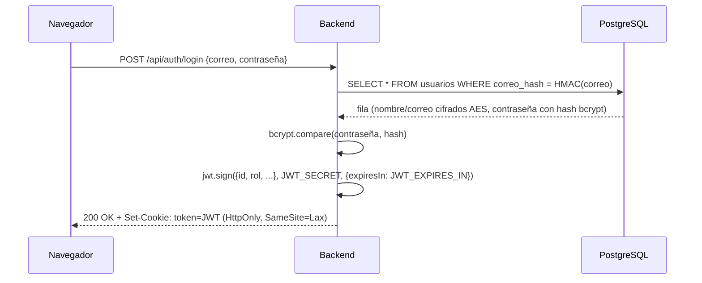
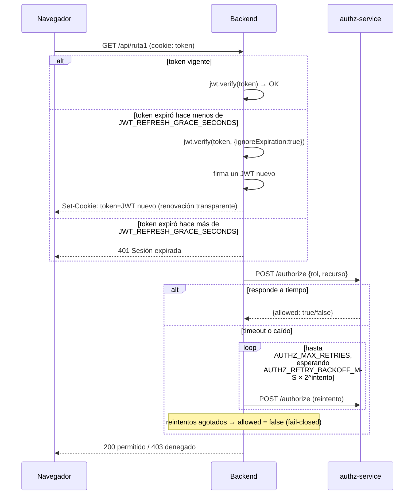

# Práctica 2 — Módulo de Registro y Login

---

## 1. Tecnologías utilizadas

| Capa | Tecnología | Uso en el proyecto |
|------|------------|---------------------|
| Backend | Node.js 22 + Express 5 | API REST principal (`P2/src`) |
| Microservicio | Node.js 22 + Express 5 | Autorización por rol, desacoplado (`P2/authz-service`) |
| Base de datos | PostgreSQL 17 | Persistencia de usuarios (`P2/database/01_init.sql`) |
| Autenticación | `jsonwebtoken` | Emisión/verificación de JWT |
| Contraseñas | `bcryptjs` | Hash unidireccional con salt |
| Cifrado | `crypto` (nativo de Node) | AES-256-CBC + HMAC-SHA256 |
| Validación | `express-validator` | Reglas de entrada por endpoint |
| Cliente HTTP interno | `axios` | Backend → microservicio de autorización |
| Documentación | `swagger-ui-express` + `js-yaml` | `openapi.yaml` servido en `/api/docs` |
| Contenedores | Docker + Docker Compose | `postgres`, `authz-service`, `backend` |
| Frontend | React 18 + Vite + `react-router-dom` | Registro, login y página de confirmación (`P2/frontend`) |

## 2. Arquitectura y diagramas de secuencia

```
Navegador (React/Vite, :5173)
        │  proxy /api → mismo origen para las cookies
        ▼
Backend principal (Express, :3000/3001) ── PostgreSQL (:5432/5434)
        │
        │  POST /authorize { rol, recurso }  (retry + backoff)
        ▼
authz-service (Express, :4000)
```

El backend principal nunca decide *por sí mismo* si un rol puede entrar a una ruta: siempre se lo
pregunta al `authz-service`, un proceso aparte que ni siquiera conoce el secreto del JWT (ver
sección de [Dependency Inversion](#d--dependency-inversion-principle)).

### 2.1 Login y emisión del JWT



### 2.2 Ruta protegida: renovación automática + consulta al microservicio



## 3. Seguridad: JWT, AES y Cookies

### JWT

- Se firma en [`security/jwt.js`](src/security/jwt.js) con `JWT_SECRET` y vive `JWT_EXPIRES_IN` (variable de entorno, ej. `15m`).
- El payload lleva `{id, rol, nombre, correo_electronico}` — con el rol adentro, el backend no necesita otra consulta a la base de datos para decidir qué mostrar.
- **Renovación automática**: cuando el token ya expiró, [`auth.middleware.js`](src/middlewares/auth.middleware.js) no lo rechaza de inmediato. Llama a `jwtService.evaluarRenovacion(token)`, que verifica la firma ignorando la expiración y compara cuánto tiempo pasó desde `exp` contra `JWT_REFRESH_GRACE_SECONDS`. Si sigue dentro de esa ventana, se firma un token nuevo y se manda en un `Set-Cookie` de la misma respuesta — el usuario nunca nota que su sesión "expiró".

### AES (datos sensibles)

- [`security/aes.js`](src/security/aes.js) cifra `nombre` y `correo_electronico` con **AES-256-CBC** (`crypto` nativo de Node), con un IV aleatorio por valor guardado como `iv:cifrado` en hexadecimal.
- **La contraseña NO se cifra con AES, se hashea con `bcrypt`.** AES es reversible: si se filtrara `AES_SECRET_KEY` todas las contraseñas quedarían en texto plano. `bcrypt` es unidireccional (con salt), que es la práctica estándar para contraseñas.
- Como el correo queda cifrado con IV aleatorio, el mismo correo produce un `ciphertext` distinto cada vez → no se puede hacer `WHERE correo_electronico = $1` para el login. Por eso existe `correo_hash`: un HMAC-SHA256 determinístico (mismo texto → mismo hash, pero no reversible) que solo se usa para búsquedas exactas, nunca para mostrar el correo.

### Cookies

- El JWT se manda solo en una cookie **HttpOnly** ([`security/cookie.js`](src/security/cookie.js)) — JavaScript en el navegador no puede leerla (`document.cookie` no la muestra), lo que mitiga robo de token por XSS.
- `SameSite=Lax` y `secure` configurable por `COOKIE_SECURE` (debe ser `true` en producción con HTTPS).
- El frontend (Vite) hace proxy de `/api` hacia el backend (`vite.config.js`) para que, desde el punto de vista del navegador, todo sea el mismo origen — así la cookie viaja sin configurar CORS con credenciales, que es la parte más propensa a errores al separar frontend y backend.

## 4. Principios SOLID — evidencia en el código

Este backend es JavaScript "funcional" (módulos con funciones, sin clases), así que S.O.L.I.D. se
aplica en su forma general: a nivel de módulos, contratos de funciones e inversión de dependencias
entre procesos, no a jerarquías de clases.

### S — Single Responsibility Principle

Cada capa cambia por una sola razón. El registro de un usuario pasa por tres módulos, cada uno con
una responsabilidad distinta:

- [`repositories/aut.repository.js`](src/repositories/aut.repository.js) — solo SQL, no sabe qué es cifrar ni qué es un JWT:
  ```js
  const crearUsuario = async (usuario) => {
      const sql = `INSERT INTO usuarios (...) VALUES ($1,$2,$3,$4,$5,$6,$7) RETURNING *;`;
      const { rows } = await pool.query(sql, values);
      return rows[0];
  };
  ```
- [`services/usuario.service.js`](src/services/usuario.service.js) — solo reglas de negocio (cifrar, hashear, validar duplicados), no sabe qué es un `Request` de Express:
  ```js
  const registrar = async ({ nombre, correo_electronico, contrasena, rol }) => {
      const correo_hash = aes.hmac(correo_electronico);
      const existente = await repository.obtenerUsuarioPorCorreoHash(correo_hash);
      if (existente) { /* 409 */ }
      const usuario = await repository.crearUsuario({
          id: uuid(),
          nombre: aes.encrypt(nombre),
          correo_electronico: aes.encrypt(correo_electronico),
          correo_hash,
          contrasena: await bcrypt.hash(contrasena, SALT_ROUNDS),
          ...
      });
      return aUsuarioPublico(usuario);
  };
  ```
- [`controllers/auth.controller.js`](src/controllers/auth.controller.js) — solo HTTP (status codes, cookies), no sabe cómo se cifra nada:
  ```js
  const registrar = async (req, res, next) => {
      const { usuario, token } = await authService.registrar(req.body);
      res.cookie(cookie.NOMBRE_COOKIE, token, cookie.opcionesCookie());
      res.status(201).json({ usuario });
  };
  ```

*Justificación:* si mañana cambia el motor de base de datos, solo se toca el repository. Si cambia
la política de cifrado, solo se toca el service. Si cambia el formato de la respuesta HTTP, solo se
toca el controller.

### O — Open/Closed Principle

La matriz de permisos del microservicio de autorización es **datos**, no lógica ramificada:

```js
// authz-service/src/permissions.js
const PERMISOS = {
    Admin: ['ruta1', 'ruta2'],
    Cliente: ['ruta2']
};

const tienePermiso = (rol, recurso) => Boolean(PERMISOS[rol]?.includes(recurso));
```

Agregar un rol nuevo (ej. `Supervisor`) o un recurso nuevo (`ruta3`) es agregar una entrada al
objeto `PERMISOS` — la función `tienePermiso`, [`requireRole.js`](src/middlewares/requireRole.js) y
[`authClient.js`](src/security/authClient.js) no se tocan. El mismo patrón aplica a
[`middlewares/validator.js`](src/middlewares/validator.js): agregar una regla de validación nueva es
agregar una línea `body(...)` al arreglo, sin tocar la función `validar` que procesa los errores.

### L — Liskov Substitution Principle

Sin clases, LSP se traduce a: cualquier función que cumpla el contrato `(req, res, next)` de Express
puede sustituir a otra en la cadena de middlewares sin romper nada, porque Express solo depende de
esa forma, no de una implementación concreta:

```js
// routes/protegido.routes.js
router.get('/ruta1', autenticar, requireRole('ruta1'), protegidoController.ruta1);
router.put('/ruta2', autenticar, requireRole('ruta2'), validator.reglasEditarUsuario, protegidoController.ruta2);
```

`autenticar`, `requireRole('ruta1')` y cada regla de `validator.reglasEditarUsuario` son
intercambiables entre rutas (de hecho `autenticar` se reutiliza tal cual en ambas rutas) porque
todas respetan el mismo contrato de middleware.

### I — Interface Segregation Principle

Cada módulo de seguridad expone solo lo mínimo que sus consumidores necesitan, en vez de un
`security.js` gigante:

```js
export default { encrypt, decrypt, hmac };            // security/aes.js
export default { firmar, verificar, evaluarRenovacion }; // security/jwt.js
export default { NOMBRE_COOKIE, opcionesCookie };         // security/cookie.js
export default { consultarPermiso };                      // security/authClient.js
```

[`auth.controller.js`](src/controllers/auth.controller.js) importa `cookie` y los servicios, pero
nunca importa `aes.js` directamente — no le hace falta cifrar nada a ese nivel. Cada consumidor
depende únicamente de la interfaz angosta que usa.

### D — Dependency Inversion Principle

Este es el requisito 9 de la práctica, aplicado directamente: [`requireRole.js`](src/middlewares/requireRole.js)
(política de alto nivel: "¿puede este rol entrar aquí?") no depende de la matriz de permisos
concreta — depende de una **abstracción** (un POST a `/authorize` que recibe `{rol, recurso}` y
devuelve `{allowed}`):

```js
// middlewares/requireRole.js
const requireRole = (recurso) => async (req, res, next) => {
    const permitido = await authClient.consultarPermiso(req.usuario.rol, recurso);
    if (!permitido) return res.status(403).json({ mensaje: 'Acceso denegado.' });
    next();
};
```

```js
// security/authClient.js
const consultarPermiso = async (rol, recurso) => {
    const { data } = await axios.post(`${AUTHZ_SERVICE_URL}/authorize`, { rol, recurso }, { timeout: 2000 });
    return Boolean(data.allowed);
};
```

La implementación real de la política (`authz-service/src/permissions.js`) vive en **otro proceso**.
Se podría reemplazar por un motor de reglas o una tabla en base de datos sin tocar una sola línea
del backend principal, porque este último solo conoce el contrato HTTP, nunca el detalle interno.

## 5. Puesta en marcha

### Requisitos previos

- Docker y Docker Compose
- Node.js 22+ (solo si vas a correr el frontend, que no está dockerizado)

### Variables de entorno

```bash
cp .env.example .env
```

Las variables por defecto ya sirven para desarrollo local. Las más relevantes:

- `JWT_EXPIRES_IN`: tiempo de vida del JWT (ej. `15m`).
- `JWT_REFRESH_GRACE_SECONDS`: ventana de gracia tras expirar en la que el token se renueva solo (ej. `300`).
- `AUTHZ_MAX_RETRIES` / `AUTHZ_RETRY_BACKOFF_MS`: reintentos y backoff al consultar el microservicio de autorización.

### Servicios

| Servicio        | Descripción                                        | Puerto (host)  |
|------------------|-----------------------------------------------------|-----------------|
| `postgres`       | Base de datos                                        | 5434 → 5432     |
| `authz-service`  | Microservicio de autorización                        | 4000            |
| `backend`        | API REST principal                                   | 3001 → 3000     |
| `frontend`       | React + Vite (se corre aparte, no está en Docker)    | 5173            |

### Levantar todo con Docker

```bash
docker compose up --build
```

Esto levanta `postgres`, `authz-service` y `backend`. El backend queda expuesto en `http://localhost:3001`.

## 6. Probar solo el backend (curl)

Con los contenedores arriba, todo se puede probar por `curl`, sin frontend.

### 6.1 Registrar un Admin y un Cliente

```bash
curl -s -X POST http://localhost:3001/api/auth/registro \
  -H "Content-Type: application/json" \
  -d '{"nombre":"Ana Admin","correo_electronico":"admin@test.com","contrasena":"password123","rol":"Admin"}'

curl -s -X POST http://localhost:3001/api/auth/registro \
  -H "Content-Type: application/json" \
  -d '{"nombre":"Carlos Cliente","correo_electronico":"cliente@test.com","contrasena":"password123","rol":"Cliente"}'
```

### 6.2 Iniciar sesión (guarda la cookie del JWT en un archivo)

```bash
curl -s -c admin_cookies.txt -X POST http://localhost:3001/api/auth/login \
  -H "Content-Type: application/json" \
  -d '{"correo_electronico":"admin@test.com","contrasena":"password123"}'

curl -s -c cliente_cookies.txt -X POST http://localhost:3001/api/auth/login \
  -H "Content-Type: application/json" \
  -d '{"correo_electronico":"cliente@test.com","contrasena":"password123"}'
```

### 6.3 Probar las rutas protegidas por rol

`Ruta 1` (`GET /api/ruta1`, solo Admin) lista todos los usuarios con rol Cliente.
`Ruta 2` (`PUT /api/ruta2`, Admin y Cliente) deja que cada quien edite su propio usuario
(nombre, correo y/o contraseña — todos opcionales; el rol nunca se puede cambiar por aquí).

| Rol      | Ruta 1 (ver clientes) | Ruta 2 (editar mi usuario) |
|----------|------------------------|------------------------------|
| Admin    | 200 permitido          | 200 permitido                |
| Cliente  | 403 denegado           | 200 permitido                |

```bash
# Solo el Admin puede ver el listado de clientes
curl -s -b admin_cookies.txt http://localhost:3001/api/ruta1
curl -s -b cliente_cookies.txt http://localhost:3001/api/ruta1   # 403 esperado

# Ambos pueden editar su propio usuario
curl -s -b admin_cookies.txt -X PUT http://localhost:3001/api/ruta2 \
  -H "Content-Type: application/json" \
  -d '{"nombre":"Ana Admin Editada"}'

curl -s -b cliente_cookies.txt -X PUT http://localhost:3001/api/ruta2 \
  -H "Content-Type: application/json" \
  -d '{"nombre":"Carlos Cliente Editado"}'
```

### 6.4 Perfil del usuario autenticado (lo usa la página de confirmación)

```bash
curl -s -b admin_cookies.txt http://localhost:3001/api/auth/me
```

### 6.5 Cerrar sesión

```bash
curl -s -b admin_cookies.txt -X POST http://localhost:3001/api/auth/logout
```

### 6.6 Probar la renovación automática del JWT

Baja `JWT_EXPIRES_IN` a algo corto (ej. `20s`) en `.env`, reinicia el backend
(`docker compose up -d --build backend`), inicia sesión, espera a que expire y vuelve a llamar
cualquier ruta protegida antes de que pase `JWT_REFRESH_GRACE_SECONDS`: la respuesta trae una
cookie `Set-Cookie` nueva sin que hayas vuelto a hacer login.

### 6.7 Probar la caída del microservicio de autorización

```bash
docker compose stop authz-service
curl -s -b admin_cookies.txt http://localhost:3001/api/ruta1   # reintenta y termina en 403, no 500
docker compose start authz-service
```

## 7. Documentación interactiva (Swagger)

Con el backend arriba: **http://localhost:3001/api/docs**

Desde ahí se puede ejecutar `POST /api/auth/login` y el resto de endpoints directamente (Swagger UI
maneja la cookie igual que un navegador).

## 8. Correr el frontend

El frontend no está dockerizado; se corre aparte para tener recarga en caliente. Su servidor de
desarrollo (Vite) hace de proxy hacia `http://localhost:3001`, así que **el backend debe estar
corriendo primero**.

```bash
cd frontend
npm install
npm run dev
```

Abre **http://localhost:5173** — registro, login y la página de confirmación con:

- Botón para ver el listado de Clientes (Ruta 1, solo Admin).
- Formulario para editar el propio usuario (Ruta 2, Admin y Cliente).
