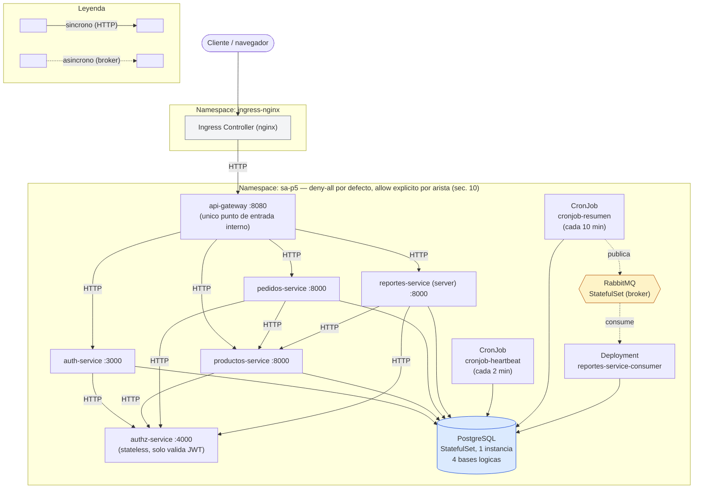

# Práctica 5 — Orquestación avanzada de microservicios en Kubernetes con Helm

Documento vivo: se va actualizando a medida que se completa cada punto del
enunciado (`P5/0780_Practica_5_SA_2S2026.pdf`). Última actualización:
comunicación asíncrona (broker) y los 2 cronjobs encadenados, completos y
probados en minikube con evidencia de cero pérdida de mensajes.

## Índice

- [1. Resumen y alcance](#1-resumen-y-alcance)
- [2. Estructura del chart de Helm](#2-estructura-del-chart-de-helm)
- [3. Decisiones de diseño](#3-decisiones-de-diseño)
- [4. Multi-stage Docker](#4-multi-stage-docker)
- [5. Comandos reproducibles (de clúster vacío a plataforma funcionando)](#5-comandos-reproducibles-de-clúster-vacío-a-plataforma-funcionando)
- [6. Problemas encontrados en la prueba real y su solución](#6-problemas-encontrados-en-la-prueba-real-y-su-solución)
- [9. Comunicación asíncrona y cronjobs encadenados](#9-comunicación-asíncrona-y-cronjobs-encadenados)
- [7. Evidencias recopiladas](#7-evidencias-recopiladas)
- [8. Pendiente](#8-pendiente)

## 1. Resumen y alcance

Se parte de los 6 microservicios de la Práctica 4 (`api-gateway`,
`auth-service`, `authz-service`, `productos-service`, `reportes-service`,
`pedidos-service`, copiados a `/P5` sin modificar su lógica de negocio) y se
empaqueta toda la plataforma como un chart de Helm para desplegarse en
Kubernetes, cumpliendo el enunciado de la Práctica 5.

Namespace de trabajo: `sa-p5`, creado por el propio `helm install
--create-namespace` (no de forma manual). Único mecanismo de despliegue:
`helm install` / `helm upgrade`.

## 2. Estructura del chart de Helm

```
P5/charts/sa-p5/                    <- chart padre
  Chart.yaml                        <- dependencias: 6 subcharts + rabbitmq + postgresql (Bitnami)
  Chart.lock
  values.yaml                       <- base: nombres deterministas, Ingress, postgresql/rabbitmq, sharedSecrets
  values-dev.yaml                   <- overrides de desarrollo
  values-prod.yaml                  <- overrides de produccion
  values.example.yaml               <- credenciales FICTICIAS (nunca reales)
  templates/
    _helpers.tpl                    <- named templates (fullname, labels, etc.)
    ingress.yaml                    <- unico punto de entrada -> Service "api-gateway"
    shared-secrets.yaml             <- Secret "sa-p5-shared-secrets" (JWT_SECRET)
  charts/
    api-gateway/                    <- subchart (Node/Express)
    auth-service/                   <- subchart (Node/Express, DB + secretos propios)
    authz-service/                  <- subchart (Node/Express, sin DB)
    productos-service/              <- subchart (Python/FastAPI, DB)
    reportes-service/                <- subchart (Python/FastAPI, DB)
    pedidos-service/                <- subchart (Python/FastAPI, DB)
    postgresql-18.8.13.tgz          <- dependencia Bitnami (no versionar, ver .gitignore)
    rabbitmq-16.0.14.tgz            <- dependencia Bitnami (no versionar, ver .gitignore)
```

Cada uno de los 6 subcharts sigue el mismo patrón interno:

```
charts/<servicio>/
  Chart.yaml
  values.yaml            <- enabled, image, config.*, secrets.* (si aplica), probes, securityContext, autoscaling
  templates/
    deployment.yaml       <- envFrom ConfigMap [+ Secret propio] [+ Secret compartido], checksum/config, required en image.tag
    service.yaml
    configmap.yaml         <- variables no sensibles (PORT, URLs internas, LOG_LEVEL, DB_HOST, etc.)
    secret.yaml             <- SOLO en auth-service (AES/HMAC/seed admin)
    serviceaccount.yaml
    hpa.yaml
    _helpers.tpl
```

Nombres de Service/Deployment fijados con `fullnameOverride` (uno por
subchart, en el `values.yaml` del padre) para que sean predecibles sin
importar el nombre del release: `api-gateway`, `auth-service`,
`authz-service`, `productos-service`, `reportes-service`,
`pedidos-service`, `postgres`, `rabbitmq`. Esto es lo que permite que los
`.env` originales de la Práctica 4 (`http://authz-service:4000`, etc.)
funcionen sin cambios dentro del clúster.

## 3. Decisiones de diseño

### 3.1 Una sola base de datos, no cuatro

El objetivo SMART de la práctica pide como mínimo **1 base de datos
persistente**. En vez de replicar las 4 instancias de Postgres de la
Práctica 4, se usa **una sola instancia** (dependencia `postgresql` de
Bitnami, `architecture: standalone`) con **4 bases de datos lógicas
adentro** (`aut`, `productos_db`, `reportes_db`, `pedidos_db`) — mismo
patrón de separación de datos, un solo StatefulSet.

Las 4 bases se crean vía `postgresql.primary.initdb.scripts` en el
`values.yaml` del padre, reutilizando el SQL de `P5/database/*_init.sql`
con un `SELECT ... WHERE NOT EXISTS ... \gexec` + `\c <base>` antepuesto a
cada uno (Postgres no soporta `CREATE DATABASE IF NOT EXISTS`). Probado
contra un Postgres real en Docker antes de confiar en él (ver sección 6).

Todos los microservicios se conectan como el superusuario `postgres`
(igual que en la Práctica 4) — no se creó un usuario de aplicación
separado por simplicidad.

### 3.2 Secretos: compartidos vs. propios

- **`sa-p5-shared-secrets`** (definido en el chart *padre*,
  `templates/shared-secrets.yaml`): solo `JWT_SECRET`, porque tiene que
  ser *idéntico* en 4 servicios (auth, productos, reportes, pedidos). Si
  cada subchart generara el suyo no habría forma de garantizar que
  coincidan.
- **`DB_PASSWORD`**: no se duplica en un Secret propio. Los 4 servicios
  con base de datos lo leen directo del Secret que genera automáticamente
  la dependencia `postgresql` de Bitnami (`postgres` / clave
  `postgres-password`, nombre fijo por su `fullnameOverride`). Una sola
  fuente de verdad.
- **Secretos exclusivos de `auth-service`** (`AES_SECRET_KEY`,
  `HMAC_SECRET_KEY`, `SEED_ADMIN_PASSWORD`): Secret propio del subchart
  (`charts/auth-service/templates/secret.yaml`).
- **Ninguna credencial real vive en el repo.** `values.yaml` /
  `values-dev.yaml` / `values-prod.yaml` dejan estos valores vacíos (con
  `required` en las plantillas, que hace fallar `helm template`/`install`
  con un mensaje claro si faltan). `values.example.yaml` trae valores
  ficticios pero *con el formato correcto* (ver bug de `AES_SECRET_KEY`
  en la sección 6) para poder probar localmente combinándolo con `-f`.

### 3.3 `helm lint` vs. `helm template`/`install` con `required`

Diferencia importante detectada al usar `required`: `helm lint` **solo
avisa** (`[INFO] Missing required value: ...`) pero sigue reportando `0
chart(s) failed`. El que realmente **frena el despliegue** es `helm
template` / `helm install` / `helm upgrade`. Ambos comportamientos son
correctos y esperados de Helm — la validación real de "no se puede
desplegar sin secretos" ocurre en `template`/`install`, no en `lint`.

### 3.4 Instalación selectiva mientras se construye

Cada uno de los 6 subcharts tiene `enabled: true` en su propio
`values.yaml`, y el `Chart.yaml` del padre declara
`condition: <servicio>.enabled` para cada dependencia local. Esto permitió
instalar solo los subcharts ya terminados (`--set
auth-service.enabled=false ...`) mientras se armaban los demás, en vez de
esperar a tener los 6 listos para poder probar algo en un clúster real.

## 4. Multi-stage Docker

Cada uno de los 6 microservicios (`api-gateway`, `auth-service`, `authz-service`,
`pedidos-service`, `productos-service`, `reportes-service`) tiene un
`Dockerfile` **multi-stage** con tres etapas:

1. **`dev`** — imagen "gorda" con todas las dependencias (incluidas las de
   desarrollo) y hot-reload (`nodemon` en los 3 servicios Node, `uvicorn
   --reload` en los 3 servicios Python). Es la que usa `docker-compose.yml`
   (`build.target: dev`) para seguir con el flujo de trabajo local de la
   Practica 4: codigo montado como volumen, cambios reflejados al vuelo.
2. **`deps` / `builder`** — etapa intermedia, invisible en el resultado
   final, que solo instala las dependencias de **produccion**:
   - Node: `npm ci --omit=dev` (requiere `package-lock.json`; se genero uno
     para `api-gateway` y `authz-service`, que no lo tenian, y se actualizo
     el de `auth-service`, que estaba desincronizado con su `package.json`).
   - Python: `pip install --no-cache-dir --prefix=/install -r requirements.txt`,
     que aisla los paquetes en `/install` en vez de mezclarlos con el Python
     del sistema del builder.
3. **`runtime`** — la imagen final y **el target por defecto** de
   `docker build` (al ser la ultima etapa del archivo, no hace falta pasar
   `--target`). Es la que se usa para el chart de Helm:
   - Base minima sin cambios (`node:22-alpine` / `python:3.12-slim`), pero
     sin herramientas de build, cache de `pip`/`npm`, ni `devDependencies`
     (se movio `nodemon` a `devDependencies` en los tres `package.json` de
     Node para que `--omit=dev` lo excluya de verdad).
   - Corre como usuario **no root** (`app`), creado explicitamente en la
     imagen — requisito del `securityContext: runAsNonRoot` de la practica.
   - Sin `--reload` / `nodemon`: el proceso arranca directo con
     `node src/server.js` o `uvicorn ... ` (sin reload), que es lo correcto
     para un contenedor inmutable en produccion.

### Como construir cada variante

```bash
# Imagen de desarrollo (equivalente a lo que arma docker-compose):
docker build --target dev -t <servicio>:dev ./<servicio>

# Imagen de produccion (para Kubernetes/Helm) — target por defecto:
docker build -t <servicio>:runtime ./<servicio>
```

`docker compose up -d --build` sigue funcionando igual que en la Practica 4
(usa el target `dev` de cada Dockerfile automaticamente).

### Comparativa de tamaño (antes vs. despues del multi-stage)

"Antes" es la imagen single-stage original de la Practica 4 (`FROM ... ; npm
install / pip install ; COPY . .`, todo en una sola capa). "Despues" es la
etapa `runtime` del Dockerfile multi-stage, medida con `docker images`.

| Microservicio | Antes (single-stage) | Despues (`runtime`) | Reduccion |
|---|---:|---:|---:|
| `api-gateway` | 213 MB | 183 MB | -30 MB (-14.1%) |
| `auth-service` | 198 MB | 186 MB | -12 MB (-6.1%) |
| `authz-service` | 178 MB | 167 MB | -11 MB (-6.2%) |
| `pedidos-service` | 176 MB | 168 MB | -8 MB (-4.5%) |
| `productos-service` | 181 MB | 173 MB | -8 MB (-4.4%) |
| `reportes-service` | 181 MB | 173 MB | -8 MB (-4.4%) |

La reduccion es mas notoria en los servicios Node (sobre todo
`api-gateway`, que ya no arrastra `nodemon` ni el resto de
`devDependencies`) que en los de Python: `psycopg2-binary` y
`strawberry-graphql[fastapi]` ya se instalaban desde wheels precompilados
en la imagen single-stage (no requerian `gcc`/`build-essential`), asi que
la ganancia ahi viene solo de descartar el cache de `pip` y las carpetas
temporales de la instalacion, no de eliminar un toolchain de compilacion.

## 5. Comandos reproducibles (de clúster vacío a plataforma funcionando)

```bash
# --- 0. Clúster local ---
# --cni=calico es obligatorio: sin un CNI real las NetworkPolicies del
# chart se aceptan pero no se aplican (ver seccion 10.1).
minikube start --cni=calico
minikube addons enable metrics-server
minikube addons enable ingress
kubectl get nodes   # confirmar Ready

# --- 1. Construir y cargar las 6 imagenes runtime en minikube ---
cd P5
for svc in api-gateway auth-service authz-service pedidos-service productos-service reportes-service; do
  docker build --target runtime -t p5-$svc:runtime ./$svc
  minikube image load p5-$svc:runtime
done

# --- 2. Dependencias del chart (RabbitMQ + PostgreSQL de Bitnami) ---
helm repo add bitnami https://charts.bitnami.com/bitnami
helm repo update
cd charts/sa-p5
helm dependency update .

# --- 3. Validar antes de instalar ---
helm lint . -f values-dev.yaml -f values.example.yaml
helm template sa-p5 . -f values-dev.yaml -f values.example.yaml > /tmp/rendered.yaml   # revision manual si hace falta

# --- 4. Instalar (namespace creado por el propio chart) ---
helm install sa-p5 . -n sa-p5 --create-namespace -f values-dev.yaml -f values.example.yaml

# --- 5. Verificar ---
kubectl get pods,svc,ingress,pvc -n sa-p5

# --- 6. Probar el flujo completo por el Ingress ---
MINIKUBE_IP=$(minikube ip)
curl --resolve sa-p5.local:80:$MINIKUBE_IP http://sa-p5.local/health

curl -c /tmp/cookies.txt --resolve sa-p5.local:80:$MINIKUBE_IP \
  -X POST http://sa-p5.local/api/auth/registro -H "Content-Type: application/json" \
  -d '{"nombre":"Test","correo_electronico":"test@test.com","contrasena":"password123"}'

curl -c /tmp/cookies.txt --resolve sa-p5.local:80:$MINIKUBE_IP \
  -X POST http://sa-p5.local/api/auth/login -H "Content-Type: application/json" \
  -d '{"correo_electronico":"test@test.com","contrasena":"password123"}'

curl -b /tmp/cookies.txt --resolve sa-p5.local:80:$MINIKUBE_IP http://sa-p5.local/api/productos
```

Para actualizar tras un cambio en el chart:

```bash
helm upgrade sa-p5 . -n sa-p5 -f values-dev.yaml -f values.example.yaml
helm history sa-p5 -n sa-p5
# rollback a la revision anterior si algo sale mal:
helm rollback sa-p5 <revision> -n sa-p5
```

Nota: si un `helm upgrade` solo cambia un **Secret**, el pod afectado NO
se reinicia solo (el `checksum/config` únicamente vigila el ConfigMap, tal
como pide el enunciado). Forzar el reinicio con:

```bash
kubectl rollout restart deployment/<servicio> -n sa-p5
```

**Actualizar la imagen de un servicio ya desplegado** (cada vez que se
reconstruye una imagen `runtime`): `minikube image load` **no sobrescribe**
un tag que ya existe en su Docker interno. Hay que borrarlo primero, lo
cual falla si algún pod (incluso uno `Completed`) sigue referenciando esa
imagen:

```bash
docker build --target runtime -t p5-<servicio>:runtime ./<servicio>
kubectl scale deployment <servicio> -n sa-p5 --replicas=0
kubectl wait --for=delete pod -l app.kubernetes.io/name=<servicio> -n sa-p5 --timeout=60s
kubectl delete pods -n sa-p5 -l app.kubernetes.io/name=<servicio> --field-selector=status.phase=Succeeded  # jobs/cronjobs viejos
minikube image rm p5-<servicio>:runtime
minikube image load p5-<servicio>:runtime
kubectl scale deployment <servicio> -n sa-p5 --replicas=1
```

## 6. Problemas encontrados en la prueba real y su solución

Ninguno de estos 3 problemas lo detectó `helm lint` ni `helm template` —
solo aparecieron al desplegar contra un clúster de Kubernetes real, que es
justo la razón por la que se hizo esta prueba antes de seguir agregando
funcionalidad.

### 6.1 `runAsNonRoot` con usuario no numérico

**Síntoma:** los 6 pods de microservicios en `CreateContainerConfigError`.

```
Error: container has runAsNonRoot and image has non-numeric user (app),
cannot verify user is non-root
```

**Causa:** los Dockerfiles hacen `USER app` (nombre). Kubernetes no puede
resolver ese nombre a un UID sin ejecutar el contenedor, así que
`securityContext.runAsNonRoot: true` por sí solo no es suficiente.

**Solución:** se obtuvo el UID/GID real de cada imagen con
`docker run --rm <imagen> id` (100/101 para las 3 imágenes Node/alpine,
999/999 para las 3 imágenes Python/slim) y se fijó explícitamente en el
`securityContext` de cada subchart:

```yaml
securityContext:
  runAsNonRoot: true
  runAsUser: 100    # o 999, segun el servicio
  runAsGroup: 101   # o 999
```

### 6.2 Imagen fija de RabbitMQ ya no existe en el repo público de Bitnami

**Síntoma:** `rabbitmq-0` en `Init:ErrImagePull`.

```
Failed to pull image "docker.io/bitnami/rabbitmq:4.1.3-debian-12-r1":
manifest unknown
```

**Causa:** Broadcom (dueño de Bitnami desde 2024) cambió su política de
distribución en 2025 — los tags de versión fija se movieron al repositorio
"legacy" (`bitnamilegacy/*`); `bitnami/*` en Docker Hub solo mantiene unas
pocas imágenes recientes de forma pública y gratuita. Confirmado con
`docker pull bitnami/rabbitmq:latest` (tampoco existe) vs.
`docker pull bitnamilegacy/rabbitmq:4.1.3-debian-12-r1` (sí existe, mismo
tag exacto).

**Solución:** override del `image.registry`/`image.repository` de la
dependencia en el `values.yaml` del padre:

```yaml
rabbitmq:
  image:
    registry: docker.io
    repository: bitnamilegacy/rabbitmq
    tag: 4.1.3-debian-12-r1
```

(`postgresql` no tuvo este problema porque su chart ya apunta a
`bitnami/postgresql:latest` por defecto, que sí sigue siendo público —
limitación conocida: no queda pinneado a una versión exacta, se acepta
porque no había un tag legacy equivalente fácil de ubicar.)

### 6.3 `AES_SECRET_KEY` ficticio con formato inválido

**Síntoma:** `POST /api/auth/registro` respondía `500 Invalid key length`.

**Causa:** `auth-service/src/security/aes.js` usa AES-256-CBC, que exige
una clave de exactamente 32 bytes. El placeholder de
`values.example.yaml` (`"changeme-aes-secret-key"`) era texto plano de
~23 caracteres, no un hex de 64 caracteres.

**Solución:** generar el valor de ejemplo con el formato real:

```bash
openssl rand -hex 32
```

Y notar que, al ser un cambio de **Secret** (no de ConfigMap), hubo que
hacer `kubectl rollout restart deployment/auth-service -n sa-p5` a mano
tras el `helm upgrade` para que el pod tomara el valor nuevo (ver nota en
la sección 5).

## 7. Evidencias recopiladas

### 7.1 Flujo completo a través del Ingress real (registro → login → listar productos)

```
$ curl --resolve sa-p5.local:80:192.168.49.2 -X POST http://sa-p5.local/api/auth/registro ...
{"usuario":{"id":"e2fef7de-...","nombre":"Test K8s","correo_electronico":"testk8s@test.com","rol":"Cliente",...}}
HTTP 201

$ curl --resolve sa-p5.local:80:192.168.49.2 -X POST http://sa-p5.local/api/auth/login ...
{"usuario":{"id":"e2fef7de-...", ...}}
HTTP 200

$ curl --resolve sa-p5.local:80:192.168.49.2 http://sa-p5.local/api/productos
[]
HTTP 200
```

Confirma la cadena completa: Ingress (nginx) → `api-gateway` →
`auth-service` (JWT + AES + HMAC + Postgres) → cookie de sesión →
`productos-service` (verifica JWT propio + `authz-service` vía
`POST /authorize`) → Postgres.

### 7.2 Persistencia: los datos sobreviven al borrado del pod de Postgres

```
$ kubectl exec -n sa-p5 postgres-0 -- psql -U postgres -d aut -c "SELECT nombre, correo_electronico FROM usuarios;"
 (2 filas, datos cifrados con AES)

$ kubectl delete pod postgres-0 -n sa-p5
pod "postgres-0" deleted

$ kubectl wait --for=condition=Ready pod/postgres-0 -n sa-p5 --timeout=90s
pod/postgres-0 condition met

$ kubectl exec -n sa-p5 postgres-0 -- psql -U postgres -d aut -c "SELECT nombre, correo_electronico FROM usuarios;"
 (las mismas 2 filas)
```

El pod se recreó desde cero (nuevo contenedor) pero el `PersistentVolumeClaim`
(`data-postgres-0`, 1Gi, `StorageClass: standard`) mantuvo los datos.

### 7.3 Estado de la instalación (revisión 3, todo `Running`)

```
NAME                                 READY   STATUS    RESTARTS   AGE
api-gateway-...                      1/1     Running   0          ...
auth-service-...                     1/1     Running   0          ...
authz-service-...                    1/1     Running   0          ...
pedidos-service-...                  1/1     Running   0          ...
postgres-0                           1/1     Running   0          ...
productos-service-...                1/1     Running   0          ...
rabbitmq-0                           1/1     Running   0          ...
reportes-service-...                 1/1     Running   0          ...
```

```
$ helm history sa-p5 -n sa-p5
REVISION  UPDATED                   STATUS      CHART        APP VERSION  DESCRIPTION
1         Fri Aug 28 10:00:13 2026  superseded  sa-p5-0.1.0  1.16.0       Install complete
2         Fri Aug 28 10:04:59 2026  superseded  sa-p5-0.1.0  1.16.0       Upgrade complete
3         Fri Aug 28 10:08:45 2026  deployed    sa-p5-0.1.0  1.16.0       Upgrade complete
```

## 9. Comunicación asíncrona y cronjobs encadenados

Implementados juntos porque son el mismo flujo: el Cronjob 2 (punto H) es
literalmente el productor del mensaje asíncrono (punto D). Todo vive en el
subchart `reportes-service`, reutilizando su imagen — no se creó un
microservicio nuevo.

### 9.1 Piezas nuevas

- **Tablas nuevas en `reportes_db`**: `cronjob_heartbeats` (un registro por
  ejecución del Cronjob 1) y `resumenes_cronjob` (donde el consumidor
  guarda lo que llega del broker). Agregadas al `primary.initdb.scripts`
  del `values.yaml` del padre — y aplicadas también a mano contra la base
  ya existente en minikube, porque los `initdb.scripts` solo corren la
  primera vez que se crea el volumen (ver nota en la sección 5).
- **`reportes-service/src/messaging/rabbitmq.py`**: conexión a RabbitMQ
  con reintentos (mismo patrón que la conexión a Postgres) y declaración
  de la cola con `durable=True`.
- **`reportes-service/src/scripts/cronjob_heartbeat.py`** (Cronjob 1):
  inserta un registro con `fecha_hora` en `America/Guatemala` (GMT-6, sin
  horario de verano) y `STUDENT_CARNE`.
- **`reportes-service/src/scripts/cronjob_resumen.py`** (Cronjob 2):
  agrupa los heartbeats por hora y publica el resumen en la cola
  `resumenes-cronjob` con `delivery_mode=2` (persistente).
- **`reportes-service/src/scripts/consumer_resumenes.py`**: Deployment de
  larga duración, **separado** del servidor HTTP (mismo Dockerfile, otro
  `command`). Consume con `prefetch_count=1` y hace `basic_ack` **solo**
  después de insertar en Postgres; si falla, `basic_nack(requeue=True)`.
- Helm: `templates/cronjob-heartbeat.yaml`, `templates/cronjob-resumen.yaml`
  y `templates/consumer-deployment.yaml` en el subchart de
  `reportes-service`, todos con `concurrencyPolicy: Forbid`,
  `backoffLimit`, `successfulJobsHistoryLimit` y `failedJobsHistoryLimit`.

### 9.2 Bug propio detectado: selectores de Deployment traslapados

Antes de probar en el clúster, noté que el Deployment del consumidor y el
del servidor HTTP de `reportes-service` iban a terminar con el **mismo**
selector (`app.kubernetes.io/name=reportes-service,
app.kubernetes.io/instance=sa-p5`), porque ninguno de los dos lo acotaba
más. Dos Deployments distintos con selectores que se traslapan es
peligroso (uno puede "adoptar" pods del otro). Se corrigió agregando
`app.kubernetes.io/component: server` / `consumer` al selector y a las
labels del pod de cada uno (y al `Service`, que también hubiera podido
enrutar tráfico HTTP hacia el consumidor por error).

### 9.3 Problemas reales encontrados al probar en minikube

1. **`ModuleNotFoundError: No module named 'src.scripts'`** — la imagen
   que corría en los pods no era la que acababa de construir.
   `minikube image load` **no sobrescribe** una imagen si ya existe un tag
   igual en su Docker interno; hay que borrarla primero
   (`minikube image rm`) y solo entonces cargar la nueva. Y `image rm`
   falla si algún contenedor (incluso uno ya `Completed`, como los pods de
   un Job viejo) sigue referenciando esa imagen — hay que limpiar esos
   pods antes.
2. **Logs del consumidor completamente vacíos** aunque el pod estaba
   `1/1 Running` y el mensaje sí se procesaba (se confirmó consultando la
   tabla directamente). Python bufferea `stdout` cuando no hay una TTY —
   mismo tipo de problema que ya habíamos visto antes con
   `productos-service` en modo standalone. Se agregó `ENV
   PYTHONUNBUFFERED=1` a los 3 Dockerfiles de Python (`productos-service`,
   `reportes-service`, `pedidos-service`), no solo al de reportes.

### 9.4 Evidencia: consumidor caído → mensajes acumulados → cero pérdida

```
$ kubectl exec -n sa-p5 postgres-0 -- psql ... -c "SELECT COUNT(*) FROM resumenes_cronjob;"
2   # antes de la prueba

$ kubectl scale deployment reportes-service-consumer -n sa-p5 --replicas=0
deployment.apps/reportes-service-consumer scaled

$ for i in 1 2 3; do kubectl create job --from=cronjob/reportes-service-cronjob-resumen down-test-$i -n sa-p5; done
# los 3 Jobs terminan en Completed: publicar en la cola no depende de que haya consumidor

$ kubectl exec -n sa-p5 rabbitmq-0 -- rabbitmqctl list_queues name messages durable
name                 messages  durable
resumenes-cronjob    3         true      # los 3 mensajes se acumularon, nadie los perdio

$ kubectl scale deployment reportes-service-consumer -n sa-p5 --replicas=1
deployment.apps/reportes-service-consumer scaled

$ kubectl logs -n sa-p5 deployment/reportes-service-consumer --tail=20
[consumer-resumenes] escuchando en la cola 'resumenes-cronjob'...
[consumer-resumenes] guardado f7359624-...: {...}
[consumer-resumenes] guardado 19e15faf-...: {...}
[consumer-resumenes] guardado 899a1cab-...: {...}

$ kubectl exec -n sa-p5 rabbitmq-0 -- rabbitmqctl list_queues name messages durable
name                 messages  durable
resumenes-cronjob    0         true      # la cola quedo vacia, todo se proceso

$ kubectl exec -n sa-p5 postgres-0 -- psql ... -c "SELECT COUNT(*) FROM resumenes_cronjob;"
5   # 2 + 3 = 5, exacto — cero perdida de mensajes
```

También se confirmó que ambos CronJobs corren solos según su horario real
(no solo invocados a mano con `kubectl create job --from=cronjob/...`):
`reportes-service-cronjob-heartbeat` cada 2 minutos y
`reportes-service-cronjob-resumen` cada 10 minutos, visibles en
`kubectl get cronjobs -n sa-p5` con `LAST SCHEDULE` avanzando solo.

## 10. NetworkPolicies (aislamiento de tráfico lateral)

### 10.1 El problema: minikube no aplica NetworkPolicy por defecto

minikube con el driver Docker por defecto no usa ningún CNI real: kubelet
conecta los pods con el bridge nativo de Docker, que **acepta** objetos
`NetworkPolicy` sin error pero **no los hace cumplir** — cualquier pod
puede hablar con cualquier otro sin importar lo que digan las policies.
Confirmado revisando `kube-system` (no había ningún pod de CNI, ni
`calico-node` ni `kindnet`) y la lista de addons de esta versión de
minikube (sin `calico` disponible ahí tampoco).

Para que el bloqueo fuera real y no solo manifiestos que "se ven bien",
recreamos el clúster con Calico como CNI:

```
$ minikube delete
$ minikube start --cni=calico
$ minikube addons enable metrics-server
$ minikube addons enable ingress
```

Esto implica reinstalar el chart desde cero. Antes de borrar el clúster
viejo, se respaldaron los valores reales en uso con
`helm get values sa-p5 -n sa-p5 -o yaml` (esos valores no vivían en ningún
archivo — se habían pasado sueltos en el `helm install` original), y se
guardaron en `charts/sa-p5/values.local.yaml` (agregado a `.gitignore`,
mismo criterio que un `values.secret.yaml`: nunca se sube al repo).

### 10.2 Diseño: deny-all + allow explícito por arista

`templates/networkpolicy-baseline.yaml`:

- `default-deny-all`: `podSelector: {}` con `policyTypes: [Ingress, Egress]`
  y sin reglas — nada entra ni sale de ningún pod del namespace salvo lo
  que se permita explícitamente después.
- `allow-dns-egress`: único permiso incondicional, egress hacia CoreDNS
  (`kube-system`, puerto 53 UDP/TCP) — sin esto ningún Service se podría
  resolver por nombre, ni siquiera para las conexiones que sí están
  permitidas.

`templates/networkpolicy-services.yaml` — una policy de "allow" por cada
nodo real del grafo de comunicación (mapeado leyendo los `config.*` de
cada subchart, no adivinado):

```
Ingress (ns ingress-nginx) -> api-gateway:8080
api-gateway -> auth-service:3000, productos-service:8000,
               pedidos-service:8000, reportes-service(server):8000
auth-service -> authz-service:4000, postgres:5432
productos-service -> authz-service:4000, postgres:5432
pedidos-service -> authz-service:4000, productos-service:8000, postgres:5432
reportes-service(server) -> authz-service:4000, productos-service:8000, postgres:5432
reportes-service(consumer) -> postgres:5432, rabbitmq:5672
reportes-service(cronjob-heartbeat) -> postgres:5432
reportes-service(cronjob-resumen) -> postgres:5432, rabbitmq:5672
```

`reportes-service` tiene 4 workloads con la misma identidad de chart pero
roles de red distintos, así que las policies los distinguen por
`app.kubernetes.io/component` (la misma label que ya se usa en sus
Deployments/CronJobs desde la sección 9.2) — por ejemplo, `rabbitmq` solo
acepta ingress de `component=consumer` y `component=cronjob-resumen`, no de
`cronjob-heartbeat` (que nunca toca la cola) ni de `server`.

`authz-service` es puramente stateless (valida JWT, no persiste nada) —
solo tiene reglas de *ingress*, sin egress propio más allá del DNS
compartido. `postgres` y `rabbitmq` también son solo-ingress: nunca
inician conexiones salientes.

### 10.3 Bug propio detectado: colisión de nombres con las policies de Bitnami

Los charts de `postgresql` y `rabbitmq` de Bitnami traen **su propia**
NetworkPolicy por defecto (`primary.networkPolicy.enabled` /
`networkPolicy.enabled`, ambos `true` de fábrica), y las nombran igual que
las nuestras (`postgres`, `rabbitmq`, por el `fullnameOverride`). Como
viven en el mismo release de Helm, la última en aplicarse "gana" el objeto
— frágil, porque depende del orden de renderizado entre subcharts en vez
de ser explícito. Se corrigió desactivando la NetworkPolicy de cada chart
de Bitnami (`postgresql.primary.networkPolicy.enabled: false`,
`rabbitmq.networkPolicy.enabled: false` en el `values.yaml` del padre) para
que la única fuente de verdad sea la nuestra. La de Bitnami además era
permisiva por defecto (`allowExternal: true`), así que no bloqueaba nada
realmente — el problema era de mantenibilidad, no de seguridad.

### 10.4 Otro problema real: `startupProbe` demasiado ajustado para un cold-start completo

Al reinstalar todo desde cero en el clúster nuevo (los 9 pods arrancando
a la vez, compitiendo por CPU en la misma máquina que además estaba
levantando Calico), `pedidos-service`, `productos-service` y
`reportes-service` entraron en `CrashLoopBackOff` repetido — no por la red,
sino porque su `startupProbe` (`failureThreshold: 6` x `periodSeconds: 5`
= 30s de presupuesto) es más corto que lo que tardan en arrancar bajo
esas condiciones. Causa raíz: los 3 crean su pool de `psycopg2` de forma
**síncrona al importar** `src/database/connection.py`
(`pool = _crear_pool()` a nivel de módulo, hasta 10 intentos x 2s antes de
que Uvicorn levante) — bajo contención de CPU esto por sí solo ya se come
buena parte de los 30s. Confirmado descartando antes la causa obvia: se
probó conectividad real con un pod de depuración (`nc`/sockets Python
contra `postgres:5432` desde cero) y respondía en milisegundos, así que
Calico no era el problema. Se corrigió subiendo `failureThreshold` a `20`
(100s de presupuesto) en esos 3 subcharts — los otros 3
(`api-gateway`, `auth-service`, `authz-service`) no mostraron el problema
porque su runtime de Node no bloquea el arranque en la conexión a la BD.

### 10.5 Evidencia: petición bloqueada vs. permitida, con Calico aplicando de verdad

Camino positivo (nada se rompió con el deny-all de fondo):

```
$ curl -H "Host: sa-p5.local" http://$(minikube ip)/health
-> HTTP 200                                          # Ingress -> api-gateway, permitido

$ kubectl exec deploy/pedidos-service -- ...  http://productos-service:8000/health
-> OK 200                                            # pedidos -> productos, permitido
```

Camino negativo (bloqueo real, medido con el reloj — no solo "no
respondió", sino que se agotó el timeout porque Calico descarta los
paquetes en vez de rechazarlos):

```
$ kubectl exec deploy/authz-service -- nc -zv -w5 postgres 5432
-> timeout a los 5s (exit 143)                       # authz-service nunca habla con la BD

$ kubectl exec deploy/authz-service -- nc -zv -w5 rabbitmq 5672
-> timeout a los 5s (exit 143)                       # tampoco con el broker

$ kubectl exec deploy/pedidos-service -- python3 -c "socket.create_connection(('rabbitmq',5672))"
-> FALLO (bloqueado) en 5.22s: timed out             # pedidos no tiene permiso a rabbitmq

$ kubectl exec deploy/api-gateway -- node -e "net.createConnection({host:'postgres',port:5432})"
-> FALLO (timeout) en 5.102s                         # api-gateway nunca toca la BD directamente
```

Control positivo, mismo tipo de prueba, servicio que sí tiene permiso
(conecta casi instantáneo, contraste directo con los timeouts de arriba):

```
$ kubectl exec deploy/productos-service -- python3 -c "socket.create_connection(('postgres',5432))"
-> CONECTO en 0.30s

$ kubectl exec deploy/reportes-service-consumer -- python3 -c "socket.create_connection(('postgres',5432))"
-> CONECTO en 0.20s
```

La diferencia entre 0.2-0.3s (conexión real) y 5s+ agotando el timeout
(paquete descartado por Calico) es la prueba de que el aislamiento es
real y selectivo — no un firewall todo-o-nada.

## 11. RBAC de mínimo privilegio

### 11.1 Punto de partida: ningún servicio llama a la API de Kubernetes

Antes de diseñar nada se verificó con `grep` en los 6 microservicios que
ninguno importa un cliente de Kubernetes (`kubernetes`, `client-go`,
`@kubernetes/*`) — todos hablan solo entre sí y con Postgres/RabbitMQ por
red, nunca con el API server. Eso cambia la pregunta de "qué necesita cada
servicio" a "qué es lo mínimo defendible si algún día lo necesitara", y
habilita una mejora que no depende de escribir ningún Role: si un pod
jamás llama a la API, no tiene sentido que cargue un token que la
autentica. Se puso `automountServiceAccountToken: false` en los 12
ServiceAccounts del stack (los 6 de los microservicios + las 3 nuevas del
punto 11.2). El Role/RoleBinding de una identidad sigue existiendo y
sigue siendo consultable vía `kubectl auth can-i --as=...` independiente
de esto — el `automount` solo decide si el *pod* llega a tener un
credencial utilizable, no si la identidad tiene permisos.

### 11.2 Diseño

Por cada uno de los 6 subcharts (`api-gateway`, `auth-service`,
`authz-service`, `pedidos-service`, `productos-service`,
`reportes-service`): un `Role` que solo permite `get` sobre **su propio**
ConfigMap (acotado con `resourceNames`, no un `get` genérico a todos los
configmaps) y un `RoleBinding` que ata ese Role a la ServiceAccount del
mismo servicio. Nada de `list`/`watch`/`create`/`update`/`delete`, y
ningún acceso a Secrets vía RBAC — los Secrets siguen siendo accesibles
únicamente como variables de entorno inyectadas por el pod spec, nunca
por llamada a la API, ni de lectura propia.

`reportes-service` tiene 4 workloads (servidor HTTP, consumidor,
2 cronjobs) que hasta este punto compartían una sola ServiceAccount —
quedó marcado como pendiente en la sección 9. Se separaron: el servidor
HTTP se queda con la ServiceAccount original (la única con Role, porque
es la única identidad con siquiera una justificación hipotética para leer
su config vía API) y el consumidor y los 2 cronjobs reciben cada uno su
**propia** ServiceAccount nueva (`reportes-service-consumer`,
`reportes-service-cronjob-heartbeat`, `reportes-service-cronjob-resumen`),
sin Role ni RoleBinding — cero permisos, no solo "los mismos permisos que
el servidor pero sin usarlos".

### 11.3 Evidencia: matriz de `kubectl auth can-i`

```
$ kubectl auth can-i get configmap/auth-service --as=system:serviceaccount:sa-p5:auth-service -n sa-p5
yes                                          # puede leer SU PROPIO configmap

$ kubectl auth can-i get configmap/productos-service --as=system:serviceaccount:sa-p5:auth-service -n sa-p5
no                                           # NO el de otro servicio

$ kubectl auth can-i get secret/auth-service --as=system:serviceaccount:sa-p5:auth-service -n sa-p5
no                                           # NO puede leer ni su propio Secret via API

$ kubectl auth can-i list configmaps --as=system:serviceaccount:sa-p5:auth-service -n sa-p5
no                                           # el Role es "get" puntual, no "list"

$ kubectl auth can-i create pods --as=system:serviceaccount:sa-p5:auth-service -n sa-p5
no

$ kubectl auth can-i get pods -A --as=system:serviceaccount:sa-p5:auth-service
no                                           # tampoco fuera de su namespace

$ for sa in reportes-service-consumer reportes-service-cronjob-heartbeat reportes-service-cronjob-resumen; do
    kubectl auth can-i get configmap/reportes-service --as=system:serviceaccount:sa-p5:$sa -n sa-p5
  done
no
no
no                                           # los 3 workers: cero permisos, sin Role alguno
```

Las mismas 6 pruebas de "get mi propio configmap" salieron `yes` para los
6 microservicios (`api-gateway`, `auth-service`, `authz-service`,
`pedidos-service`, `productos-service`, `reportes-service`).

## 12. ResourceQuota y LimitRange

### 12.1 Diseño

`ResourceQuota` (`sa-p5-quota`, un objeto para todo el namespace) pone
techo a `requests.cpu`/`requests.memory`/`limits.cpu`/`limits.memory`,
además de `pods` y `persistentvolumeclaims`. Se dimensionó con margen
sobre el consumo real medido en minikube en dev (~635m/1580m cpu req/lim,
~816Mi/1440Mi mem req/lim entre los 9 pods de aplicación + Postgres +
RabbitMQ): `requests.cpu: 1500m`, `requests.memory: 1536Mi`,
`limits.cpu: 3000m`, `limits.memory: 3Gi`, `pods: 30`,
`persistentvolumeclaims: 5`. `values-prod.yaml` la sube a 6/12 CPU y
6/12Gi de memoria porque ahí el HPA puede llevar cada uno de los 6
microservicios hasta 5 réplicas (30 pods de aplicación en el peor caso) —
la cuota de dev bloquearía el propio autoescalado.

`LimitRange` (`sa-p5-limits`) define, por contenedor: `defaultRequest`
(50m/64Mi) y `default` (200m/256Mi) para cualquier container que
"olvide" declarar sus propios requests/limits (hoy ninguno lo hace, todos
los declaran explícitamente — es un cinturón de seguridad, no una
necesidad actual), y un rango `min: 10m/16Mi` — `max: 500m/512Mi` que
ningún contenedor puede cruzar por accidente, verificado contra los
valores más altos que existen hoy en el chart (RabbitMQ de Bitnami,
380m/384Mi de límite).

### 12.2 Evidencia: cuota excedida de verdad

```
$ kubectl get resourcequota sa-p5-quota -n sa-p5
persistentvolumeclaims: 2/5, pods: 9/30, requests.cpu: 635m/1500m,
requests.memory: 816Mi/1536Mi   limits.cpu: 1580m/3, limits.memory: 1440Mi/3Gi

$ kubectl scale deployment productos-service -n sa-p5 --replicas=30
deployment.apps/productos-service scaled

$ kubectl get deployment productos-service -n sa-p5
READY   UP-TO-DATE   AVAILABLE
1/30    10           1                          # se estanca en 10, no llega a 30

$ kubectl describe replicaset -n sa-p5 -l app.kubernetes.io/name=productos-service | tail -5
Warning  FailedCreate  Error creating: pods "productos-service-...-2jpk7" is forbidden:
  exceeded quota: sa-p5-quota, requested: limits.cpu=150m, used: limits.cpu=2930m, limited: limits.cpu=3

$ kubectl scale deployment productos-service -n sa-p5 --replicas=1   # se revierte la prueba
```

El límite que se agotó primero fue `limits.cpu` (no `pods`, que tenía
mucho más margen) — confirma que la cuota realmente está sumando el
consumo real de los pods creados, no solo contando objetos.

## 13. PodDisruptionBudget

### 13.1 Diseño

Un `PodDisruptionBudget` con `minAvailable: 1` por cada uno de los 6
microservicios (Deployments `api-gateway`, `auth-service`,
`authz-service`, `pedidos-service`, `productos-service` y, acotado
explícitamente a `component: server`, `reportes-service` — sin ese
acotamiento el PDB también contaría los pods del consumidor y de los
Jobs de los cronjobs, que son réplicas de workloads distintos que
comparten el mismo chart). Protege contra **disrupciones voluntarias**
(`kubectl drain`, upgrade de nodo, cluster-autoscaler) — no contra
crashes ni contra rollouts normales de `Deployment`, que crean/borran
pods directamente sin pasar por la Eviction API.

Postgres y RabbitMQ ya traen su propio PDB por defecto del chart de
Bitnami (`maxUnavailable: 1`) — no fue necesario agregar nada ahí.

### 13.2 Bug/nuance real encontrado: `minAvailable: 1` con 1 sola réplica bloquea TODO desalojo

En dev (`replicaCount: 1` en los 6 servicios) un PDB con `minAvailable: 1`
dice, en la práctica, "nunca se puede desalojar la única réplica que
existe" — `ALLOWED DISRUPTIONS` queda en `0`. Es el comportamiento
correcto (evita quedarse con cero réplicas), pero vale la pena dejarlo
explícito: es exactamente la razón por la que prod corre con 2+ réplicas
por servicio, para que el PDB permita drenar nodos sin dejar el servicio
en cero.

### 13.3 Evidencia: desalojo bloqueado vs. permitido, contra la Eviction API real

```
$ kubectl get pdb -n sa-p5
NAME            MIN AVAILABLE   ALLOWED DISRUPTIONS
auth-service    1               0                    # 1 sola replica, 0 desalojos permitidos

$ kubectl proxy --port=8001 &
$ curl -X POST http://localhost:8001/api/v1/namespaces/sa-p5/pods/auth-service-.../eviction \
    -H "Content-Type: application/json" \
    -d '{"apiVersion":"policy/v1","kind":"Eviction","metadata":{"name":"auth-service-...","namespace":"sa-p5"}}'
-> HTTP 429 TooManyRequests
   "Cannot evict pod as it would violate the pod's disruption budget."
   "The disruption budget auth-service needs 1 healthy pods and has 1 currently"

$ kubectl scale deployment auth-service -n sa-p5 --replicas=2
$ kubectl get pdb auth-service -n sa-p5
ALLOWED DISRUPTIONS: 1                            # con 2 replicas, ya hay margen

$ curl -X POST http://localhost:8001/.../pods/auth-service-.../eviction -d '...'
-> HTTP 201 Success                               # esta vez SI se permite

$ kubectl scale deployment auth-service -n sa-p5 --replicas=1   # se revierte la prueba
```

La misma llamada a la Eviction API, con el mismo PDB, cambia de `429` a
`201` únicamente por tener una réplica de más — prueba que el PDB está
leyendo el estado real del Deployment, no un valor estático.

## 14. Estrategia de rollout sin caída de servicio

### 14.1 Diseño

Los 6 Deployments de microservicios usan `strategy.type: RollingUpdate`
con `maxUnavailable: 0` y `maxSurge: 1`:

- `maxUnavailable: 0` obliga a que en todo momento existan al menos las
  mismas réplicas *listas* (readinessProbe en verde) que había antes de
  empezar el rollout — nunca se tumba un pod viejo sin que el nuevo ya
  esté sirviendo tráfico.
- `maxSurge: 1` es lo que hace esto posible incluso con `replicaCount: 1`
  (dev): en vez de tener que escalar a 0 antes de crear el reemplazo (lo
  que sí causaría caída), el Deployment crea temporalmente un pod
  **adicional** — hay 2 réplicas por un momento — y solo cuando el nuevo
  pasa su `readinessProbe` elimina el viejo.

Esto depende directamente de que cada servicio tenga un `readinessProbe`
real contra `/health` (ya existía desde la sección de salud/resiliencia) —
sin uno, Kubernetes consideraría al pod nuevo "listo" apenas arranca el
contenedor, sin importar si la app ya puede atender tráfico, y la
garantía de cero caída sería falsa.

### 14.2 Evidencia: rollout real con tráfico continuo, cero fallos

Se disparó un rollout real de `productos-service` (cambio de
`config.logLevel` vía `helm upgrade --set`, que cambia el
`checksum/config` y por lo tanto el pod template) mientras
`pedidos-service` — que sí tiene permiso de red hacia
`productos-service:8000` según las NetworkPolicies de la sección 10 —
golpeaba `http://productos-service:8000/health` cada 0.2s durante 45
segundos:

```
$ kubectl exec deploy/pedidos-service -- python3 -c "... loop de 45s golpeando /health cada 0.2s ..."
&
$ helm upgrade sa-p5 . -n sa-p5 -f values-dev.yaml -f values.local.yaml \
    --set productos-service.config.logLevel=info
$ kubectl rollout status deployment/productos-service -n sa-p5
Waiting for deployment "productos-service" rollout to finish: 1 old replicas are pending termination...
deployment "productos-service" successfully rolled out

# resultado del loop:
{"ok": 222, "fail": 0}
fallos: []
```

**222 peticiones, 0 fallos** durante todo el rollout. Los eventos del
namespace confirman el orden exacto (pod nuevo arriba y listo, DESPUÉS el
viejo abajo — nunca al revés ni simultáneo):

```
$ kubectl get events -n sa-p5 --sort-by='.lastTimestamp' | grep productos-service
...Created  pod/productos-service-c765858bc-6q9jk        # (46s) pod nuevo creado
...Started  pod/productos-service-c765858bc-6q9jk        # (45s) contenedor arranca
...Unhealthy Startup probe failed ...                     # (36s) todavia inicializando, normal
...Unhealthy Readiness probe failed ... nxb7b              # (30s) el pod VIEJO, en pleno shutdown
...Killing pod/productos-service-...-nxb7b                 # (31s) recien AHORA se apaga el viejo
...ScalingReplicaSet ... Scaled down ... from 1 to 0        # (31s) confirma el orden: nuevo listo -> viejo fuera
```

## 15. Probes exec para el Deployment del consumidor

### 15.1 El problema: el consumidor no expone HTTP

Los otros 6 Deployments usan `httpGet /health` para sus 3 probes. El
consumidor de RabbitMQ (`reportes-service-consumer`) es un proceso de
larga duración sin servidor HTTP — no hay ningún puerto contra el cual
apuntar un `httpGet`. La alternativa estándar de Kubernetes para este
caso es un probe tipo `exec`.

### 15.2 Diseño: archivo de latido + probe exec

`src/scripts/consumer_resumenes.py` arranca un hilo en segundo plano
(`_latir`) que reescribe `/health/consumer-healthy` con el timestamp
actual cada 10s — pero **solo después** de conectar de verdad a
RabbitMQ, para que los probes no reporten "sano" antes de tiempo. El
archivo vive en un `emptyDir` montado en `/health` porque el resto del
pod corre con `readOnlyRootFilesystem: true` (no se puede escribir
directamente sobre el filesystem raíz).

Los 3 probes (`startupProbe`, `livenessProbe`, `readinessProbe`) son
`exec` con un mismo patrón: un one-liner de Python que calcula
`time.time() - <timestamp del archivo>` y sale con código 0 si es menor
al umbral de frescura configurado, o 1 si no:

- `startupProbe`: umbral 60s, `periodSeconds: 5`, `failureThreshold: 20`
  (100s de presupuesto — mismo criterio que el resto de servicios,
  sección 10.4 — para tolerar los reintentos de conexión a RabbitMQ).
- `livenessProbe` / `readinessProbe`: umbral 30s (3x el intervalo de
  latido, margen razonable), `periodSeconds: 10`, `failureThreshold: 3`.

Si el hilo principal se cuelga (deadlock, excepción no capturada que
mata el hilo pero no el proceso, etc.) el archivo deja de refrescarse y
el `livenessProbe` lo detecta en, como máximo, ~30s + 2×10s ≈ 50s.

### 15.3 Evidencia: proceso colgado de verdad → detección → reinicio automático

Simular un "cuelgue" real requirió un hallazgo interesante: enviar
`SIGSTOP` al PID 1 del contenedor **desde dentro de su propio namespace**
(vía `kubectl exec ... kill`) **no funciona** — el kernel de Linux
descarta explícitamente `SIGSTOP`/`SIGKILL` dirigidos al proceso "init"
de un PID namespace cuando el remitente está DENTRO de ese mismo
namespace (la misma protección que existe para que un proceso init mal
escrito no se auto-mate por accidente). Confirmado con `/proc/1/status`
mostrando `State: S (sleeping)` sin cambios pese al `kill()` "exitoso".
La señal sí funciona si se manda **desde fuera** del namespace, es decir,
desde el daemon Docker del nodo:

```
$ CID=$(kubectl get pod ... -o jsonpath='{.status.containerStatuses[0].containerID}' | sed 's|docker://||')
$ minikube ssh -- "docker kill --signal=STOP $CID"
$ minikube ssh -- "docker top $CID -eo pid,stat,cmd"
PID      STAT   CMD
359425   Tsl    python -m src.scripts.consumer_resumenes    # T = detenido de verdad

$ kubectl get pod -n sa-p5 -l app.kubernetes.io/component=consumer
# ~50s despues:
$ kubectl describe pod ... | grep -A3 Events
Warning  Unhealthy  Liveness probe failed: ...
Normal   Killing    Container consumer failed liveness probe, will be restarted
Normal   Started    Container consumer  # nuevo intento
$ kubectl get pod -n sa-p5 -l app.kubernetes.io/component=consumer
READY   RESTARTS
1/1     1                                # se recupero solo, sin intervencion manual
```

El `livenessProbe` detectó el cuelgue y Kubernetes reinició el
contenedor automáticamente, sin ninguna acción manual — exactamente el
comportamiento que se busca con un probe de salud.

## 16. Prueba de carga y escalado del HPA

### 16.1 Diseño

Los 6 subcharts ya traían `HorizontalPodAutoscaler` (autoscaling/v2) desde
que se construyó cada uno, gateado por `autoscaling.enabled` — pero
`values-dev.yaml` lo trae apagado (dev corre con `replicaCount: 1` fijo)
y nunca se había probado bajo carga real. Se le agregó además un
`behavior.scaleDown.stabilizationWindowSeconds` configurable (por defecto
60s): Kubernetes por defecto espera 300s estables antes de reducir
réplicas para evitar oscilaciones con tráfico intermitente, pero en un
namespace tan pequeño como este 60s de margen ya alcanza y hace que la
reducción sea observable sin esperar 5 minutos.

Para la prueba se habilitó el HPA solo en `productos-service` (vía `helm
upgrade --set`, sin tocar los archivos del chart): `minReplicas: 1`,
`maxReplicas: 4`, `targetCPUUtilizationPercentage: 50` — un umbral bajo a
propósito para poder disparar el escalado con una carga sintética modesta
en un solo nodo de minikube.

La carga se generó **desde dentro del clúster**, no desde afuera: un
script Python con `httpx.AsyncClient` (40 corrutinas concurrentes,
inyectado por stdin a `kubectl exec` para no chocar con
`readOnlyRootFilesystem`) corriendo dentro del pod de `pedidos-service`
golpeando `http://productos-service:8000/health` sin parar. Se eligió
`pedidos-service` como origen porque es uno de los que las NetworkPolicies
de la sección 10 sí autorizan a hablar con `productos-service:8000` — un
pod de carga genérico sin esas labels habría sido bloqueado por el
deny-all, que es exactamente el comportamiento correcto.

### 16.2 Evidencia: ciclo completo de escalado hacia arriba y hacia abajo

```
$ kubectl get hpa productos-service -n sa-p5     # antes de la carga
cpu: 7%/50%   REPLICAS: 1

# ... arranca la carga (40 corrutinas concurrentes contra /health) ...

$ kubectl top pod -l app.kubernetes.io/name=productos-service
productos-service-...   22m   55Mi          # 22m/40m de request = 55% > 50%

$ kubectl get hpa productos-service -n sa-p5
cpu: 55%/50%  REPLICAS: 1                    # cruzo el umbral, esperando el proximo ciclo

$ kubectl get hpa productos-service -n sa-p5
cpu: 105%/50% REPLICAS: 3                    # escalo de 1 a 3
$ kubectl describe hpa productos-service -n sa-p5
Normal  SuccessfulRescale  New size: 3; reason: cpu resource utilization (percentage of request) above target

# ... se detiene la carga (script llego a su duracion, ~200s, >9000 peticiones, 0 fallos) ...

$ kubectl get hpa productos-service -n sa-p5     # ~60s (stabilizationWindow) despues
cpu: 5%/50%   REPLICAS: 1

$ kubectl describe hpa productos-service -n sa-p5
Normal  SuccessfulRescale  New size: 1; reason: All metrics below target
```

Secuencia completa de eventos del Deployment:

```
$ kubectl get events -n sa-p5 | grep -i "ScalingReplicaSet\|SuccessfulRescale"
SuccessfulRescale   New size: 3; reason: cpu resource utilization (percentage of request) above target
ScalingReplicaSet   Scaled up replica set productos-service-... from 1 to 3
SuccessfulRescale   New size: 1; reason: All metrics below target
ScalingReplicaSet   Scaled down replica set productos-service-... from 3 to 1
```

El ciclo completo — subida por CPU real y bajada automática al cesar la
carga, sin ninguna intervención manual — quedó demostrado. Terminada la
prueba se revirtió el `--set` (un `helm upgrade` normal con los mismos
`-f` de siempre ya lo deja igual que antes, porque el override nunca se
guardó en ningún archivo del chart).

## 17. Diagrama de arquitectura

Muestra los 3 elementos pedidos: qué vive dentro/fuera del clúster, cuáles
flujos son síncronos (HTTP, línea sólida) vs. asíncronos (RabbitMQ, línea
punteada), y dónde caen los límites de las NetworkPolicies (el borde del
namespace `sa-p5`, con deny-all de fondo + allow explícito por arista —
sección 10).



Notas que no se ven a simple vista en el diagrama pero son parte del
diseño (documentadas a fondo en sus secciones respectivas):

- El único recurso alcanzable desde fuera del clúster es el Ingress →
  `api-gateway`; ni Postgres ni RabbitMQ ni ningún otro microservicio
  tienen ruta de entrada externa (sección 10.2, política `api-gateway`).
- `authz-service` no tiene ninguna arista de salida propia — es
  puramente stateless, solo responde `permitido/denegado`.
- Postgres y RabbitMQ nunca inician conexiones salientes — solo reciben.
- `reportes-service` son 4 workloads distintos (server, consumer, 2
  cronjobs) que comparten chart e imagen pero tienen ServiceAccounts,
  NetworkPolicies y roles de red diferentes entre sí (secciones 10 y 11).

## 18. `helm rollback` formal, con 2 versiones de chart reales

### 18.1 Guion de la prueba

En vez de simular un rollback artificial, se reprodujo el escenario real
que lo justifica: publicar una versión nueva del chart con un bug, verlo
fallar en el clúster, revertir de inmediato con `helm rollback`, y
después sí corregir el bug y volver a publicar la versión arreglada.

1. `Chart.yaml`: `version: 0.1.0` → `0.2.0`.
2. Bug deliberado: `authz-service.image.tag` apuntando a `runtime-v2`, un
   tag que nunca se construyó (inyectado con `--set` para esta prueba,
   sin tocar el valor real del subchart — igual que la técnica usada en
   la sección 14 para forzar el rollout de `productos-service`).
3. `helm upgrade` → se despliega la 0.2.0 rota.
4. `helm rollback sa-p5 13` (13 = última revisión buena en 0.1.0).
5. Se corrige el bug de verdad en el archivo (`tag: "runtime"`) y se
   vuelve a publicar como 0.2.0, esta vez correcta.

### 18.2 Evidencia: el fallo fue real, y el rollout de la sección 14 lo contuvo

```
$ kubectl get pods -n sa-p5 -l app.kubernetes.io/name=authz-service
authz-service-566798f7b9-v4v9v   1/1   Running        0     (pod viejo, sigue sirviendo)
authz-service-5cbbf85c8b-s65kq   0/1   ErrImagePull   0     (pod nuevo, roto)
```

El detalle importante: gracias a `maxUnavailable: 0` (sección 14), el pod
viejo **nunca se apagó** — el rollout se queda esperando indefinidamente
a que el pod nuevo pase su probe, y como nunca lo hace (no hay imagen que
arrancar), el viejo sigue sirviendo tráfico. Confirmado en caliente,
desde otro pod, mientras el pod roto seguía en `ErrImagePull`:

```
$ kubectl exec deploy/auth-service -- node -e "http.get('http://authz-service:4000/health', ...)"
status: 200                                    # el servicio nunca se cayo
```

### 18.3 Evidencia: `helm rollback` real

```
$ helm history sa-p5 -n sa-p5
13   ...   superseded   sa-p5-0.1.0   Upgrade complete       # ultima buena
14   ...   superseded   sa-p5-0.2.0   Upgrade complete       # 0.2.0 rota (primer intento)
15   ...   superseded   sa-p5-0.2.0   Upgrade complete       # 0.2.0 rota (con el --set del bug)

$ helm rollback sa-p5 13 -n sa-p5
Rollback was a success!

$ kubectl get pods -n sa-p5 -l app.kubernetes.io/name=authz-service
authz-service-566798f7b9-v4v9v   1/1   Running   0            # el pod roto desaparecio por completo

$ kubectl get deployment authz-service -n sa-p5 -o jsonpath='{.spec.template.spec.containers[0].image}'
p5-authz-service:runtime                                       # de vuelta al tag bueno

$ helm history sa-p5 -n sa-p5
16   ...   deployed   sa-p5-0.1.0   Rollback to 13              # queda registrado como rollback, no como upgrade
```

### 18.4 Cierre: se corrige el bug de verdad y se vuelve a publicar

```
$ # tag corregido a "runtime" en el archivo real del subchart
$ helm upgrade sa-p5 . -n sa-p5 -f values-dev.yaml -f values.local.yaml

$ helm history sa-p5 -n sa-p5
17   ...   deployed   sa-p5-0.2.0   Upgrade complete            # 0.2.0 definitiva, esta vez sin el bug
```

Historial completo y honesto: 0.1.0 (buena) → 0.2.0 (rota) → rollback a
0.1.0 (recuperación) → 0.2.0 (corregida, estado final). El chart en el
repositorio queda en `version: 0.2.0` sin ningún rastro del tag roto.

## 19. Preguntas teóricas (punto 6 del PDF)

*Nota: al releer el PDF con cuidado para escribir esta sección, el punto
6 en realidad trae **8** preguntas, no 6 como se había anotado en el
checklist de este documento en una lectura anterior — se corrige aquí y
se responden las 8.*

**1. ¿Qué es Helm y qué problema resuelve frente a los manifiestos
sueltos?**

Helm es el gestor de paquetes de Kubernetes: empaqueta un conjunto de
manifiestos como una unidad versionada (*chart*), con templating,
valores parametrizables por ambiente, y un ciclo de vida completo
(install/upgrade/rollback/uninstall) rastreado como *release*. Frente a
aplicar manifiestos sueltos con `kubectl apply -f`, resuelve tres
problemas concretos que vivimos de primera mano en este proyecto:

- **No hay versionado atómico del estado desplegado.** Con manifiestos
  sueltos, un cambio parcial deja el clúster en un punto intermedio sin
  ninguna forma de saber "a qué versión completa volver". Con Helm, cada
  `upgrade` es una revisión completa (sección 18).
- **No hay rollback real.** `kubectl apply` no guarda un historial del
  estado deseado anterior que se pueda restaurar con un solo comando.
  Lo comprobamos literalmente: rompimos `authz-service` a propósito y
  `helm rollback sa-p5 13` restauró el clúster completo en segundos
  (sección 18).
- **No hay dependencias declaradas ni parametrización por ambiente.**
  Nuestro `Chart.yaml` declara `postgresql` y `rabbitmq` como
  dependencias versionadas de Bitnami, resueltas con
  `helm dependency update` — con manifiestos sueltos habría que copiar y
  mantener manualmente esos YAMLs. Y un solo set de plantillas sirve para
  dev y prod gracias a `values-dev.yaml`/`values-prod.yaml`.

**2. ¿Diferencia entre chart, release y repository?**

- **Chart**: la definición empaquetada y reutilizable — plantillas,
  `values.yaml` por defecto y `Chart.yaml` con metadata y dependencias.
  En este proyecto: `sa-p5`, con 6 subcharts propios y 2 dependencias de
  Bitnami.
- **Release**: una instancia *desplegada* de un chart, en un namespace y
  clúster concretos, identificada por nombre y con su propio historial
  de revisiones. Aquí: el release `sa-p5` en el namespace `sa-p5`, que ya
  lleva 17 revisiones reales (`helm history`).
- **Repository**: el índice donde se publican y descargan charts por
  nombre y versión (ej. `https://charts.bitnami.com/bitnami`, de donde
  se resuelven `postgresql` y `rabbitmq`). Nuestro propio chart **no**
  está publicado en ningún repositorio — se instala directo desde el
  path local `./charts/sa-p5`; publicarlo en un repo propio (GitHub
  Pages/OCI) era parte de lo "recomendado pero no obligatorio" del punto
  3.2 del PDF, y se dejó fuera de alcance.

**3. ¿Qué es un StatefulSet y cuándo NO usarlo?**

Es el controlador de Kubernetes para workloads con **identidad estable**:
cada réplica tiene un nombre de red predecible (`postgres-0`), un volumen
persistente propio que la sigue si el pod se recrea, y un orden
garantizado de creación/eliminación. Se usó para `postgres` y `rabbitmq`
precisamente porque ambos necesitan disco propio y una identidad de red
fija.

**Cuándo NO usarlo**: para cualquier workload *sin estado propio* donde
las réplicas son intercambiables — exactamente el caso de los 6
microservicios de este proyecto, todos `Deployment`. Usar `StatefulSet`
ahí habría sido un error de diseño: complica el rollout (por defecto es
secuencial, más lento que un `Deployment`) sin ningún beneficio, porque
su estado real vive en Postgres, no en el pod. Regla práctica aplicada:
*¿el pod necesita su propio disco o un nombre de red fijo para funcionar
correctamente? Si la respuesta es no, `Deployment`.*

**4. ¿Diferencia entre liveness, readiness y startup probe?**

- **startupProbe**: solo corre al inicio; hasta que no pasa una vez, ni
  liveness ni readiness se evalúan. Existe para procesos de arranque
  lento — los 3 servicios Python de este proyecto, cuyo pool de
  `psycopg2` se crea de forma síncrona al importar el módulo, la
  necesitaron con un presupuesto amplio (secciones 10.4 y 15) para no
  tener que inflar el resto del ciclo de vida del pod.
- **readinessProbe**: decide si el pod debe **recibir tráfico ahora
  mismo** (lo entra o saca de los endpoints del Service). Un fallo *no*
  reinicia el contenedor. Es la que sostiene el rollout sin caída de la
  sección 14: `maxUnavailable: 0` solo funciona si Kubernetes puede
  distinguir correctamente "el pod nuevo ya está listo" de "todavía no".
- **livenessProbe**: decide si el contenedor está roto de forma
  irrecuperable. Un fallo sí lo mata y lo reinicia. Lo demostramos de
  forma literal en la sección 15: congelamos el proceso del consumidor
  con `SIGSTOP` desde fuera de su namespace, el `livenessProbe` lo
  detectó en ~50s y Kubernetes lo reinició solo, sin intervención
  manual.

En una frase: *startup* = "¿ya terminó de arrancar?" (una sola vez),
*readiness* = "¿puede recibir tráfico ahora?" (continuo, no mata),
*liveness* = "¿sigue vivo/funcional?" (continuo, si falla mata).

**5. ¿Qué es una NetworkPolicy y por qué el tráfico es permitido por
defecto?**

Es un objeto que define reglas de firewall a nivel de pod (ingress y/o
egress) según selectores de labels y namespaces — pero la aplica el
**CNI**, no la API de Kubernetes. Lo aprendimos de la forma difícil en la
sección 10.1: minikube con su CNI por defecto **acepta** las
NetworkPolicies sin error, pero no las **hace cumplir**; tuvimos que
recrear el clúster entero con Calico para que el bloqueo fuera real.

El tráfico es permitido por defecto porque el modelo de red base de
Kubernetes exige que, sin ninguna policy de por medio, cualquier pod
pueda hablar con cualquier otro — así el clúster funciona "out of the
box" sin configuración extra. Solo cuando se crea la **primera**
NetworkPolicy cuyo `podSelector` selecciona a un pod, ese pod pasa a
"denegar todo lo no permitido explícitamente" para el tipo de tráfico
(Ingress/Egress) que esa policy declara; antes de eso sigue totalmente
abierto. Por eso el primer paso real en la sección 10.2 no fue ninguna
regla de "allow", sino un `default-deny-all` explícito con
`podSelector: {}` sobre *todo* el namespace: sin eso, cualquier
microservicio que se nos olvidara cubrir con su propia policy seguiría
100% expuesto.

**6. ¿Qué es PodDisruptionBudget?**

Un objeto que declara cuántas réplicas de un grupo de pods (por
selector) deben seguir disponibles — o cuántas pueden faltar como
máximo — durante una **disrupción voluntaria**: iniciada por un humano o
por el propio clúster (`kubectl drain`, upgrade de nodo,
cluster-autoscaler), nunca por un crash. Lo comprobamos contra la
Eviction API real en la sección 13: con `minAvailable: 1` y solo 1
réplica, un intento de desalojo devolvió `HTTP 429`
("would violate the pod's disruption budget"); con 2 réplicas, la misma
llamada devolvió `201`. Punto importante: un PDB **no** protege contra
que el pod muera solo (OOM, crash, un `livenessProbe` matándolo) — ahí
no hay ninguna decisión de "¿lo dejo desalojar?" que bloquear.

**7. ¿Qué ventajas y qué nuevos problemas introduce la comunicación
asíncrona?**

Ventajas, vividas de primera mano en la sección 9:

- **Desacople temporal**: el productor (Cronjob 2) no necesita que el
  consumidor esté vivo para terminar su trabajo — publica y termina.
- **Resiliencia ante caídas**: si el consumidor cae, el trabajo no se
  pierde — queda en la cola durable y se retoma solo al volver. Muy
  distinto a una llamada HTTP síncrona, que simplemente falla si el
  destino está caído. Lo demostramos apagando el consumidor 45 segundos,
  acumulando 3 mensajes, y viendo los 5 finales sin pérdida alguna.
- **Absorción de picos**: la cola actúa de buffer si el productor genera
  trabajo más rápido de lo que el consumidor puede procesarlo.

Problemas nuevos, también reales en este proyecto:

- **Ya no hay una respuesta inmediata de éxito/fracaso** para quien
  publica — hay que diseñar explícitamente qué pasa si el mensaje nunca
  se procesa (acá: ack manual solo tras persistir en Postgres, y
  `nack(requeue=True)` si algo falla).
- **Un componente más que puede fallar**: el broker mismo, con su propio
  ciclo de vida, persistencia (StatefulSet) y su propia NetworkPolicy y
  RBAC — más superficie operativa, no menos.
- **Posible reentrega duplicada**: un `nack` con `requeue=True` puede
  reentregar el mismo mensaje más de una vez si el error persiste;
  `prefetch_count=1` evita el reprocesamiento *concurrente*, pero no
  garantiza *exactly-once*.
- **Debugging más difícil**: un fallo ya no aparece como un stack trace
  síncrono en la petición original, sino como un mensaje reencolado en
  algún punto posterior. Nos costó justamente detectarlo al inicio,
  porque los logs del consumidor no aparecían por el buffering de
  stdout de Python (sección 9.3) — el mensaje se procesaba
  correctamente, pero no había ninguna señal visible de ello.

**8. ¿Qué hace `helm rollback` internamente?**

No "deshace" un diff como `git revert`. En cada revisión, Helm guarda en
el clúster (como Secret, en el namespace del release) el **manifest ya
renderizado por completo** de esa revisión — el YAML final resuelto, no
el chart ni los `values` que lo generaron. `helm rollback <release>
<revisión>` toma ese manifest completo de la revisión destino y genera
una revisión **nueva** (nunca reescribe ni borra la antigua) cuyo
contenido es idéntico al de esa revisión pasada, y lo aplica contra el
clúster con el mismo motor de *3-way merge* que usa `helm upgrade`.

Esto explica exactamente lo que vimos en la sección 18: el rollback a la
revisión 13 no "regresó en el tiempo" el contador — avanzó hacia
adelante, creando la revisión 16, marcada `Rollback to 13`, con chart
`0.1.0`. Y explica también por qué funcionó perfectamente aunque
`Chart.yaml` **en disco** ya decía `0.2.0` en ese momento: `helm
rollback` no lee los archivos del chart en el filesystem, lee lo que
quedó guardado de esa revisión dentro del clúster.


## 20. Guía rápida 

Comandos listos para copiar/pegar durante la calificación, organizados
por los 6 rubros de "Conocimiento" de la rúbrica. Todos usan el release
ya desplegado (`sa-p5`, namespace `sa-p5`). Antes de empezar:

```bash
cd P5/charts/sa-p5
kubectl get pods -n sa-p5                 # estado base: 9 pods Running/Completed
helm history sa-p5 -n sa-p5 | tail -5     # confirmar que el release esta sano
```

Si algo queda "raro" a media demo, el comando de reset universal (vuelve
exactamente al estado base, sin ningun `--set` de ninguna demo anterior):

```bash
helm upgrade sa-p5 . -n sa-p5 -f values-dev.yaml -f values.local.yaml
```

---

### 20.1 Ciclo de vida con Helm (install, upgrade, rollback)

**Mostrar que la plataforma completa se instala con un solo comando** (no
hace falta ejecutarlo, ya esta instalado — mostrar el comando y el
historial real que prueba que ya se hizo varias veces):

```bash
helm lint . -f values-dev.yaml -f values.local.yaml     # sin errores ni warnings
helm template sa-p5 . -f values-dev.yaml -f values.local.yaml | head -30  # renderiza bien
helm history sa-p5 -n sa-p5              # 17+ revisiones reales de esta sesion de pruebas
```

**Upgrade en vivo** (cambia una config no sensible, se ve reflejada en
el ConfigMap y provoca un rollout controlado):

```bash
helm upgrade sa-p5 . -n sa-p5 -f values-dev.yaml -f values.local.yaml \
  --set api-gateway.config.logLevel=debug
kubectl rollout status deployment/api-gateway -n sa-p5
kubectl get configmap api-gateway-config -n sa-p5 -o yaml | grep LOG_LEVEL
```

**Rollback en vivo** (usa el numero de revision que te haya dado el
`helm history` de arriba, la ANTERIOR a la que acabas de crear):

```bash
helm history sa-p5 -n sa-p5 | tail -3     # anota el numero de la revision N-1
helm rollback sa-p5 <N-1> -n sa-p5
helm history sa-p5 -n sa-p5 | tail -3     # debe verse "Rollback to <N-1>"
```

**Si piden ver una falla real recuperada con rollback** (el guion
completo ya quedo documentado en la sección 18: revisiones 13→17,
`authz-service` con un tag de imagen inexistente, `ErrImagePull` real, y
recuperacion con `helm rollback sa-p5 13`). Se puede mostrar solo con:

```bash
helm history sa-p5 -n sa-p5 | sed -n '13,17p'
```

**Cerrar siempre con el reset** (deja `api-gateway` en `logLevel: info`
otra vez):

```bash
helm upgrade sa-p5 . -n sa-p5 -f values-dev.yaml -f values.local.yaml
```

---

### 20.2 Configuración, secretos y persistencia

**ConfigMaps generados por el chart** (variables no sensibles):

```bash
kubectl get configmap -n sa-p5
kubectl get configmap auth-service-config -n sa-p5 -o yaml
```

**Secrets** (nunca hay credenciales reales en el repo — `values.example.yaml`
trae solo valores ficticios; los reales viven en `values.local.yaml`,
gitignored):

```bash
kubectl get secret -n sa-p5
kubectl get secret auth-service-secrets -n sa-p5 -o yaml   # valores en base64, nunca en texto plano
```

**Un cambio en el ConfigMap reinicia los pods afectados solo** (gracias
a la annotation `checksum/config`; un Secret NO hace esto — es
comportamiento a proposito, ver sección 6):

```bash
kubectl get pod -n sa-p5 -l app.kubernetes.io/name=auth-service -o jsonpath='{.items[0].metadata.name}'
helm upgrade sa-p5 . -n sa-p5 -f values-dev.yaml -f values.local.yaml \
  --set auth-service.config.logLevel=debug
kubectl rollout status deployment/auth-service -n sa-p5   # se ve el pod reemplazarse solo
kubectl get pod -n sa-p5 -l app.kubernetes.io/name=auth-service   # nombre de pod distinto
helm upgrade sa-p5 . -n sa-p5 -f values-dev.yaml -f values.local.yaml   # reset
```

**Persistencia: los datos sobreviven al borrado del pod de la base de
datos** (StatefulSet + PVC):

```bash
# Contar registros ANTES de borrar el pod
kubectl exec -n sa-p5 postgres-0 -- bash -c \
  'PGPASSWORD=$(cat /opt/bitnami/postgresql/secrets/postgres-password) psql -U postgres -d reportes_db -c "SELECT COUNT(*) FROM cronjob_heartbeats;"'

kubectl get pvc -n sa-p5                 # data-postgres-0, Bound, 1Gi

kubectl delete pod postgres-0 -n sa-p5   # se borra el pod (NO el PVC)
kubectl wait --for=condition=Ready pod/postgres-0 -n sa-p5 --timeout=120s

# Mismo conteo DESPUES: debe ser igual o mayor (nunca menor)
kubectl exec -n sa-p5 postgres-0 -- bash -c \
  'PGPASSWORD=$(cat /opt/bitnami/postgresql/secrets/postgres-password) psql -U postgres -d reportes_db -c "SELECT COUNT(*) FROM cronjob_heartbeats;"'
```

---

### 20.3 Comunicación asíncrona mediante broker

**Flujo end-to-end en vivo**: apagar el consumidor, forzar publicaciones,
ver que se acumulan en la cola, prenderlo, ver que se procesan sin
pérdida (el mismo guion de la sección 9.4):

```bash
# Conteo ANTES
kubectl exec -n sa-p5 postgres-0 -- bash -c \
  'PGPASSWORD=$(cat /opt/bitnami/postgresql/secrets/postgres-password) psql -U postgres -d reportes_db -c "SELECT COUNT(*) FROM resumenes_cronjob;"'

# Apagar el consumidor
kubectl scale deployment reportes-service-consumer -n sa-p5 --replicas=0

# Forzar 2-3 publicaciones manuales (no depende de que el consumidor este vivo)
kubectl create job --from=cronjob/reportes-service-cronjob-resumen demo-pub-1 -n sa-p5
kubectl create job --from=cronjob/reportes-service-cronjob-resumen demo-pub-2 -n sa-p5

# Ver que los mensajes se acumularon en la cola (durable=true)
kubectl exec -n sa-p5 rabbitmq-0 -- rabbitmqctl list_queues name messages durable

# Prender el consumidor de nuevo
kubectl scale deployment reportes-service-consumer -n sa-p5 --replicas=1
kubectl wait --for=condition=Ready pod -l app.kubernetes.io/component=consumer -n sa-p5 --timeout=60s

# La cola debe quedar en 0 y el conteo en Postgres debe haber subido exactamente lo publicado
kubectl exec -n sa-p5 rabbitmq-0 -- rabbitmqctl list_queues name messages durable
kubectl exec -n sa-p5 postgres-0 -- bash -c \
  'PGPASSWORD=$(cat /opt/bitnami/postgresql/secrets/postgres-password) psql -U postgres -d reportes_db -c "SELECT COUNT(*) FROM resumenes_cronjob;"'

# Ver los logs del consumidor procesando (PYTHONUNBUFFERED=1 asegura que SI aparezcan)
kubectl logs -n sa-p5 deployment/reportes-service-consumer --tail=20

# Limpiar los jobs manuales de la demo
kubectl delete job -n sa-p5 demo-pub-1 demo-pub-2
```

---

### 20.4 Exposición, aislamiento de red y seguridad

**Único punto de entrada = Ingress → api-gateway** (nada mas es
alcanzable desde fuera):

```bash
kubectl get ingress -n sa-p5
curl -H "Host: sa-p5.local" http://$(minikube ip)/health
kubectl get svc -n sa-p5    # todos ClusterIP, ninguno NodePort/LoadBalancer
```

**NetworkPolicies bloqueando tráfico lateral de verdad** (requiere el
CNI Calico, ya activo en este clúster — ver sección 10.1):

```bash
kubectl get networkpolicy -n sa-p5    # 13 policies: 1 deny-all + 1 allow-dns + 11 de servicios

# Negativo: authz-service NUNCA deberia poder llegar a postgres (no tiene permiso)
kubectl exec -n sa-p5 deploy/authz-service -- nc -zv -w5 postgres 5432
# esperado: se cuelga y agota el timeout de 5s (bloqueado, no "connection refused")

# Positivo (control): productos-service SI puede llegar a postgres
kubectl exec -n sa-p5 deploy/productos-service -- python3 -c \
  "import socket,time; t=time.time(); s=socket.create_connection(('postgres',5432),timeout=5); print('CONECTO en %.2fs'%(time.time()-t))"
```

**RBAC de mínimo privilegio**:

```bash
# Positivo: auth-service puede leer SU PROPIO configmap
kubectl auth can-i get configmap/auth-service --as=system:serviceaccount:sa-p5:auth-service -n sa-p5

# Negativo: no el de otro servicio, no Secrets, no listar, no crear pods
kubectl auth can-i get configmap/productos-service --as=system:serviceaccount:sa-p5:auth-service -n sa-p5
kubectl auth can-i get secret/auth-service --as=system:serviceaccount:sa-p5:auth-service -n sa-p5
kubectl auth can-i create pods --as=system:serviceaccount:sa-p5:auth-service -n sa-p5
```

**securityContext restrictivo** (en cualquier pod):

```bash
kubectl get pod -n sa-p5 -l app.kubernetes.io/name=auth-service -o jsonpath='{.items[0].spec.containers[0].securityContext}' | python3 -m json.tool
# runAsNonRoot: true, readOnlyRootFilesystem: true, allowPrivilegeEscalation: false, capabilities.drop: [ALL]
```

---

### 20.5 Escalado y resiliencia bajo carga

**Probes diferenciadas (startup/readiness/liveness)**:

```bash
kubectl describe pod -n sa-p5 -l app.kubernetes.io/name=auth-service | grep -A2 "Liveness\|Readiness\|Startup"
```

**PodDisruptionBudget bloqueando un desalojo real** (Eviction API, no
solo el manifiesto):

```bash
kubectl get pdb -n sa-p5   # auth-service: ALLOWED DISRUPTIONS: 0 (1 sola replica)

kubectl proxy --port=8001 &
POD=$(kubectl get pod -n sa-p5 -l app.kubernetes.io/name=auth-service -o jsonpath='{.items[0].metadata.name}')
curl -s -X POST "http://localhost:8001/api/v1/namespaces/sa-p5/pods/$POD/eviction" \
  -H "Content-Type: application/json" \
  -d "{\"apiVersion\":\"policy/v1\",\"kind\":\"Eviction\",\"metadata\":{\"name\":\"$POD\",\"namespace\":\"sa-p5\"}}" \
  -w "\nHTTP %{http_code}\n"
# esperado: HTTP 429, "would violate the pod's disruption budget"
kill %1   # cierra el kubectl proxy
```

**Rollout sin caída de servicio** (`maxUnavailable: 0`, `maxSurge: 1`):

```bash
# En una terminal: monitoreo continuo
kubectl exec -n sa-p5 deploy/pedidos-service -- python3 -c "
import urllib.request, time
ok=fail=0
t0=time.time()
while time.time()-t0 < 30:
    try:
        r = urllib.request.urlopen('http://productos-service:8000/health', timeout=2)
        ok += 1 if r.status==200 else 0
    except Exception:
        fail += 1
    time.sleep(0.2)
print('ok=%d fail=%d' % (ok, fail))
"
# En otra terminal, EN PARALELO: disparar el rollout
helm upgrade sa-p5 . -n sa-p5 -f values-dev.yaml -f values.local.yaml \
  --set productos-service.config.logLevel=debug
kubectl rollout status deployment/productos-service -n sa-p5
# resultado esperado del monitoreo: fail=0
helm upgrade sa-p5 . -n sa-p5 -f values-dev.yaml -f values.local.yaml   # reset
```

**HPA escalando bajo carga real y bajando solo** (requiere habilitarlo,
esta apagado en dev por defecto):

```bash
helm upgrade sa-p5 . -n sa-p5 -f values-dev.yaml -f values.local.yaml \
  --set productos-service.autoscaling.enabled=true \
  --set productos-service.autoscaling.minReplicas=1 \
  --set productos-service.autoscaling.maxReplicas=4 \
  --set productos-service.autoscaling.targetCPUUtilizationPercentage=50

# En una segunda terminal: dejar esto corriendo para ver el escalado en vivo
kubectl get hpa productos-service -n sa-p5 -w

# En una TERCERA terminal: generar carga real (IMPORTANTE: con duracion fija,
# no un "while True" que dependa de que alguien lo interrumpa a mano — un
# script sin limite de tiempo es EXACTAMENTE lo que se quedo corriendo 9
# horas sin que nadie se diera cuenta durante la preparacion de esta guia).
# Este corre en PRIMER PLANO (sin "&") durante 180s exactos y se apaga solo:
kubectl exec -n sa-p5 deploy/pedidos-service -- python3 -c "
import asyncio, time, httpx
DURACION = 180
async def golpear(c, contador):
    while True:
        try:
            r = await c.get('http://productos-service:8000/health', timeout=5)
            contador['ok' if r.status_code == 200 else 'fail'] += 1
        except Exception:
            contador['fail'] += 1
async def main():
    contador = {'ok': 0, 'fail': 0}
    t0 = time.time()
    async with httpx.AsyncClient() as c:
        tareas = [asyncio.create_task(golpear(c, contador)) for _ in range(40)]
        while time.time() - t0 < DURACION:
            await asyncio.sleep(5)
            print(f'[{int(time.time()-t0)}s] ok={contador[\"ok\"]} fail={contador[\"fail\"]}', flush=True)
        for t in tareas:
            t.cancel()
    print('TERMINADO —', contador)
asyncio.run(main())
"
# El comando de arriba termina solo a los 180s (imprime "TERMINADO" y regresa
# el control de la terminal). En la segunda terminal deberia verse REPLICAS
# subir mientras corre, y bajar solo a 1 unos 60-90s despues de que termine
# (stabilizationWindowSeconds: 60).

# Ctrl+C en la segunda terminal para cerrar el "kubectl get hpa -w".
helm upgrade sa-p5 . -n sa-p5 -f values-dev.yaml -f values.local.yaml   # apaga el HPA, vuelve al reset
```

---

### 20.6 CronJobs encadenados y funcionales

```bash
kubectl get cronjobs -n sa-p5
# LAST SCHEDULE avanzando solo confirma que corren en su horario real
# (cada 2 min el heartbeat, cada 10 min el resumen), no solo a mano.

# Disparar ambos manualmente para verlos correr YA, en orden:
kubectl create job --from=cronjob/reportes-service-cronjob-heartbeat demo-hb -n sa-p5
kubectl wait --for=condition=Complete job/demo-hb -n sa-p5 --timeout=30s
kubectl logs -n sa-p5 job/demo-hb

kubectl create job --from=cronjob/reportes-service-cronjob-resumen demo-res -n sa-p5
kubectl wait --for=condition=Complete job/demo-res -n sa-p5 --timeout=30s
kubectl logs -n sa-p5 job/demo-res

# Verificar la cadena completa: heartbeat -> postgres -> resumen -> rabbitmq -> consumer -> postgres
kubectl exec -n sa-p5 postgres-0 -- bash -c \
  'PGPASSWORD=$(cat /opt/bitnami/postgresql/secrets/postgres-password) psql -U postgres -d reportes_db -c "SELECT fecha_hora, carne FROM cronjob_heartbeats ORDER BY id DESC LIMIT 3;"'

kubectl delete job -n sa-p5 demo-hb demo-res   # limpiar los jobs de la demo
```
