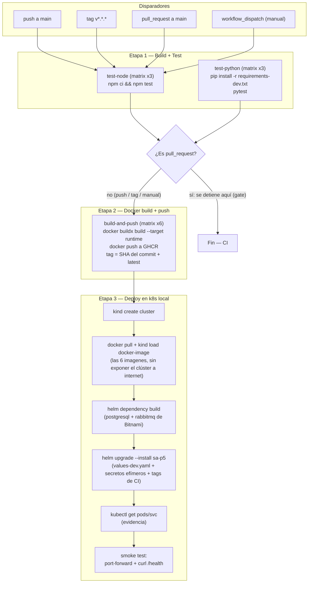

# Práctica 7 — Integración y despliegue continuo (CI/CD)

Pipeline de CI/CD para los 6 microservicios de la Práctica 5
(`api-gateway`, `auth-service`, `authz-service`, `pedidos-service`,
`productos-service`, `reportes-service`), implementado con **GitHub
Actions**. Despliegue en **Kubernetes local (`kind`)**, no en la nube — el
enunciado (sección 3.2, punto 6: "Despliegue automático usando k8s") no
exige un proveedor administrado, y la Práctica 6 ya cubrió el caso de un
clúster en la nube (EKS); esta práctica se enfoca en la automatización del
flujo, no en repetir la infraestructura administrada.

Workflow: [`.github/workflows/ci-cd.yml`](../../.github/workflows/ci-cd.yml)
(vive en la raíz del repo porque GitHub Actions solo descubre workflows en
`.github/workflows/`, no dentro de `/P7`).

## Índice

1. Decisiones de diseño
2. Arquitectura del pipeline (diagrama)
3. Las 4 etapas en detalle
4. Disparadores (versionamiento)
5. Secretos y configuración del clúster de CI
6. Cómo reproducirlo localmente
7. Relación con las Prácticas 5 y 6
8. Evidencia de ejecución

---

## 1. Decisiones de diseño

| Decisión | Elegido | Alternativa descartada | Por qué |
|---|---|---|---|
| Registry de imágenes | **GHCR** (`ghcr.io`) | DockerHub | Usa el `GITHUB_TOKEN` que ya existe en cada corrida del workflow — cero secretos que crear o rotar manualmente. |
| Clúster de despliegue | **kind**, creado y destruido dentro del propio job | minikube / clúster persistente | `kind` corre sobre el Docker del runner de GitHub sin instalación adicional; es efímero por diseño, que es exactamente lo que necesita un pipeline (cada corrida parte de cero, sin arrastrar estado de la anterior). |
| Framework de test (Node) | `node --test` (nativo desde Node 18) + `supertest` | Jest | Los 3 servicios Node ya son ESM (`"type": "module"`); Jest necesita configuración extra para ESM, el test runner nativo no. Una dependencia menos. |
| Alcance de los tests | Smoke tests puros (sin DB/broker reales) | Tests de integración contra Postgres/RabbitMQ real | `productos-service`, `pedidos-service` y `reportes-service` abren su pool de conexión a Postgres **al importar el módulo** (`pool = _crear_pool()` a nivel de archivo, ver `src/database/connection.py`), con reintentos de hasta 20s antes de fallar. Levantar Postgres/RabbitMQ solo para el paso de "test" habría hecho la etapa de CI lenta y frágil por una razón ajena a lo que se quiere probar ahí; en cambio se testean los validadores Pydantic (lógica pura, sin I/O) y, en los servicios Node, los endpoints que no tocan la base de datos (`/health`, `/authorize`). La prueba de que el sistema completo con base de datos funciona ocurre en la etapa de **deploy**, contra el sistema real. |
| Secretos usados en el deploy de CI | Generados en el propio workflow (valores efímeros, algunos con `openssl rand`) | GitHub Secrets del repositorio | El clúster `kind` se destruye al terminar el job — no hay nada que proteger a largo plazo. Guardar secretos "reales" en GitHub Secrets solo para un clúster que vive 5 minutos añadía complejidad sin beneficio. En un pipeline a producción sí irían en Secrets. |

## 2. Arquitectura del pipeline



Las tres etapas quedan como **jobs separados** en GitHub Actions (en vez de
pasos dentro de un solo job) a propósito: así se ven como fases
independientes en la pestaña *Actions*, cada una con su propio log y su
propio ✅/❌, que es lo que pide la rúbrica ("Implementar al menos 4 etapas
del pipeline: build, test, dockerización y despliegue").

## 3. Las 4 etapas en detalle

### 3.1 Build + Test (`test-node`, `test-python`)

Dos jobs en paralelo, cada uno con `strategy.matrix` sobre sus 3 servicios
— si un servicio falla su test, los otros 5 no se bloquean y queda claro
cuál fue.

- **Node** (`api-gateway`, `auth-service`, `authz-service`): `npm ci`
  (build reproducible desde `package-lock.json`) y `npm test`, que corre
  `node --test tests/*.test.js`. Se prueban `/health`, rutas 404, y en
  `authz-service` la matriz de permisos (`POST /authorize`).
- **Python** (`productos-service`, `pedidos-service`, `reportes-service`):
  `pip install -r requirements-dev.txt` y `pytest -q`, que valida los
  modelos Pydantic (`ProductoCrear`, `PedidoCrear`, `ReporteOut`) — reglas
  de negocio (precio > 0, stock ≥ 0, cantidad > 0, lista de ítems no vacía)
  sin depender de una base de datos real.

### 3.2 Dockerización automática (`build-and-push`)

`needs: [test-node, test-python]` — no corre si algún test falló. Matrix
sobre los 6 servicios; cada uno hace `docker buildx build` apuntando al
stage `runtime` de su Dockerfile multi-stage (ya existente desde la
Práctica 5) y lo publica en GHCR con dos tags: el SHA del commit (trazable
a una corrida exacta) y `latest`.

`if: github.event_name != 'pull_request'` — en un PR solo se corre
build+test como *gate* (evita publicar imágenes o desplegar por cada PR
abierto, y evita necesitar permisos de escritura en PRs de forks).

### 3.3 Push a GHCR

Integrado en el mismo job anterior (`docker/build-push-action` con
`push: true`) — separar "build" de "push" en jobs distintos hubiera
significado reconstruir la imagen o pasarla entre jobs como artifact, sin
ganar nada.

### 3.4 Despliegue automático en k8s (`deploy-k8s`)

`needs: build-and-push`. Pasos:

1. `helm/kind-action` crea un clúster Kubernetes real (`kind`) dentro del
   runner.
2. Se hace `docker pull` de las 6 imágenes recién publicadas en GHCR y
   `kind load docker-image` las inyecta directamente en el containerd del
   clúster — así el `Deployment` las encuentra con `imagePullPolicy:
   IfNotPresent` sin necesitar que el clúster tenga credenciales de GHCR.
3. `helm dependency build` resuelve las dependencias de Bitnami
   (`postgresql`, `rabbitmq`) declaradas en `Chart.yaml`.
4. `helm upgrade --install sa-p5 P5/charts/sa-p5` con `values-dev.yaml`
   como base, más `--set` para los secretos efímeros y para apuntar
   `image.repository`/`image.tag` de los 6 subcharts a las imágenes que
   se acaban de publicar.
5. Verificación: `kubectl get pods/svc -n sa-p5` (evidencia) y un smoke
   test real (`port-forward` al `api-gateway` + `curl /health`).

## 4. Disparadores (versionamiento)

```yaml
on:
  push:
    branches: [main]
    tags: ["v*.*.*"]
    paths: ["P5/**", ".github/workflows/ci-cd.yml"]
  pull_request:
    branches: [main]
    paths: ["P5/**", ".github/workflows/ci-cd.yml"]
  workflow_dispatch:
```

- `push` a `main` → pipeline completo (test → build → push → deploy).
- Tag `v1.0.0` (por ejemplo) → mismo pipeline completo; permite marcar
  releases explícitas del sistema.
- `pull_request` → solo test + build, como gate antes de mergear.
- `workflow_dispatch` → corrida manual desde la pestaña Actions, útil para
  demostraciones.
- `paths` acota el disparo a cambios dentro de `P5/**` (o al propio
  workflow) — el repo es un monorepo con `P1`…`P7`; sin este filtro,
  cualquier cambio en otra práctica dispararía este pipeline sin motivo.

## 5. Secretos y configuración del clúster de CI

El chart `P5/charts/sa-p5` exige (`required` en sus templates) contraseña
de Postgres, credenciales de RabbitMQ, un `JWT_SECRET` compartido y una
clave AES de 32 bytes para `auth-service`. En desarrollo local esos valores
viven en `values.local.yaml` (no versionado). En CI, el job `deploy-k8s`
los genera al vuelo con `--set` (ver tabla de la sección 1) — son válidos
solo mientras el clúster `kind` existe, que se destruye al terminar el job
del runner.

## 6. Cómo reproducirlo localmente

```bash
# Etapa 1 (ejemplo, un servicio Node y uno Python)
cd P5/authz-service && npm ci && npm test
cd P5/productos-service && python3 -m venv .venv && ./.venv/bin/pip install -r requirements-dev.txt && ./.venv/bin/pytest -q

# Etapa 3, con kind instalado localmente
kind create cluster --name sa-p5-local
cd P5/charts/sa-p5 && helm dependency build
helm upgrade --install sa-p5 . -n sa-p5 --create-namespace \
  -f values-dev.yaml -f values.local.yaml   # values.local.yaml con secretos reales, no versionado
kubectl get pods -n sa-p5
```

## 7. Relación con las Prácticas 5 y 6

Esta práctica **no reimplementa** la aplicación ni el chart de Helm — los
reutiliza tal cual de la Práctica 5 (`P5/charts/sa-p5`, mismos
Dockerfiles). La Práctica 6 demostró el mismo sistema desplegado en un
clúster administrado (EKS); esta práctica automatiza el ciclo completo
(commit → test → imagen → despliegue) contra un clúster local efímero, que
es el foco real del enunciado (CI/CD), no la infraestructura de nube.

## 8. Evidencia de ejecución

*(completar tras la primera corrida exitosa del workflow: capturas de la
pestaña Actions con las 4 etapas en verde, y de los paquetes publicados en
GHCR — ver también
[`GuiaDemostracion.md`](GuiaDemostracion.md) para el checklist de
evidencia que pide la rúbrica).*
