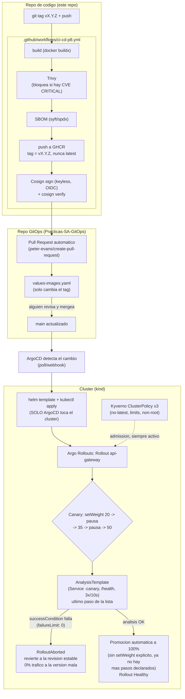

# Práctica 8 — GitOps, entrega progresiva y seguridad de la cadena de suministro

Evolución del pipeline de la Práctica 7 hacia un modelo **GitOps**: el
repositorio de manifiestos ([`Practicas-SA-GitOps`](https://github.com/TefiAnaide/Practicas-SA-GitOps))
es la única fuente de verdad del clúster, **ArgoCD** es el único
componente que aplica cambios, y ningún workflow de CI/CD ejecuta
`kubectl`/`helm` contra el clúster directamente.

## Índice

1. Decisiones de diseño
2. Diagrama del flujo (commit → clúster)
3. Terraform: infraestructura del clúster
4. Helm: empaquetado por servicio
5. GitOps con ArgoCD
6. Entrega progresiva con Argo Rollouts
7. Cadena de suministro (Trivy, SBOM, Cosign)
8. Políticas de admisión (Kyverno)
9. Gestión de secretos (Sealed Secrets)
10. Validación automatizada (k6)
11. Fallo inducido — ver [`InformeIncidente.md`](InformeIncidente.md)
12. Guía de demostración — ver [`GuiaDemostracion.md`](GuiaDemostracion.md)

---

## 1. Decisiones de diseño

| Decisión | Elegido | Por qué |
|---|---|---|
| Motor de políticas | **Kyverno** | Políticas en YAML puro (sin Rego), instalación liviana, curva de aprendizaje mínima bajo el tiempo disponible. |
| Gestión de secretos | **Sealed Secrets** | Todo vive dentro del clúster (controlador + `kubeseal`), sin depender de un proveedor externo (Vault/AWS) — encaja con un clúster local `kind`. |
| Estrategia de entrega progresiva | **Canary** en `api-gateway` únicamente | Es el único punto de entrada de la plataforma (P5), así que un fallo ahí es fácil de demostrar con un `curl`; los otros 5 servicios se quedan con `Deployment` normal — el enunciado no exige los 6. |
| Repositorio del chart de Helm | Vive en el repo **GitOps**, no en el de código | La `Application` de ArgoCD exige que su `repoURL` sea el repo GitOps — si el chart se quedara en el repo de código, ArgoCD no podría sincronizar desde ahí sin violar esa separación. |
| Infraestructura del clúster (namespace, cuota, límites, RBAC) | **Terraform**, en el repo de código (`P8/terraform/`) | Es lo que exige el enunciado explícitamente; antes (P5) vivía como templates de Helm — se movió y se sacó del chart para que no compitan dos dueños por el mismo objeto. |

## 2. Diagrama del flujo

## 3. Terraform: infraestructura del clúster

[`P8/terraform/`](../terraform/) — provider `kubernetes`, sin backend
remoto (el clúster de práctica es efímero). Declara:

- `kubernetes_namespace.app` — namespace `sa-p8`.
- `kubernetes_resource_quota.app` / `kubernetes_limit_range.app` — mismos
  valores que ya usaba el chart de Helm en la Práctica 5 (movidos aquí,
  quitados del chart).
- `kubernetes_service_account/role/role_binding.service` (`for_each`
  sobre los 6 microservicios) — mínimo privilegio: cada `ServiceAccount`
  solo puede leer (`get`) su propio `ConfigMap`. Los charts de Helm ya no
  crean estas identidades (`serviceAccount.create: false`).

Validado con `terraform init -backend=false && terraform validate` y
aplicado de verdad contra un clúster `kind` local (21 recursos creados)
antes de escribir el resto del stack.

## 4. Helm: empaquetado por servicio

Reutiliza el chart umbrella de la Práctica 5 ([`charts/sa-p5`](../../P5/charts/sa-p5))
con 6 subcharts (uno por microservicio) — copiado al repo GitOps y
adaptado:

- Se quitaron `resourcequota.yaml`/`limitrange.yaml` (ahora Terraform).
- Se quitaron `role.yaml`/`rolebinding.yaml`/`serviceaccount.yaml` de
  cada subchart (ídem).
- `values-images.yaml` — nuevo archivo, el único que el pipeline
  modifica automáticamente (solo los `tag:`).
- `helm lint --with-subcharts` corre en el pipeline
  ([`ci-cd-p8.yml`](../../.github/workflows/ci-cd-p8.yml), job `helm-lint`).

## 5. GitOps con ArgoCD

Una única `Application` ([`argocd-application.yaml`](https://github.com/TefiAnaide/Practicas-SA-GitOps/blob/main/argocd-application.yaml)
en el repo GitOps) con `syncPolicy.automated` (`prune` + `selfHeal`):
cualquier cambio manual hecho a mano en el clúster se revierte solo al
estado declarado en Git. `repoURL` apunta al repo GitOps; el pipeline de
CI **nunca** aplica nada al clúster — solo abre el Pull Request que,
al mergearse, es lo único que ArgoCD sincroniza.

## 6. Entrega progresiva con Argo Rollouts

Ver [`chart/charts/api-gateway/templates/rollout.yaml`](https://github.com/TefiAnaide/Practicas-SA-GitOps/blob/main/chart/charts/api-gateway/templates/rollout.yaml)
y [`analysistemplate.yaml`](https://github.com/TefiAnaide/Practicas-SA-GitOps/blob/main/chart/charts/api-gateway/templates/analysistemplate.yaml).

Estrategia canary, 3 pasos de `setWeight` (20/35/50) con `analysis` como
**último** paso declarado: al pasar, Argo Rollouts promueve automáticamente
al 100% sin necesitar un `setWeight: 100` explícito, y si falla, aborta ahí
mismo — el 50% sigue siendo el techo de exposición antes de validar. Tres
hallazgos de una prueba real contra un clúster `kind` (no solo lectura de
la documentación):

1. **`stableService`/`canaryService` no pueden ser el mismo nombre** — si
   se omiten ambos, Argo Rollouts hace "basic canary" sin problema, pero
   el `AnalysisTemplate` necesita un Service que apunte **solo** al
   canary (si no, el chequeo de salud se mezcla con pods de la revisión
   estable vía el Service compartido — confirmado: mediciones
   alternando `"ok"`/`"degraded"` en la misma corrida). Se agregó un
   Service `-canary` dedicado solo para el análisis.
2. **`failureLimit` es cuántos fallos SE TOLERAN, no cuántos hacen
   fallar** — con `failureLimit: 1` una versión rota pasó igual (1
   medición fallida, 2 exitosas, resultado `Successful`). Se corrigió a
   `failureLimit: 0`.
3. **`analysis` debe ser el último paso de `steps`, no uno intermedio** —
   el script de verificación (`P8/Fix_Script_p8.sh`) comprueba que la
   promoción dependa del análisis con `jq -e '.spec.strategy.canary.steps[]?.analysis'`;
   como `jq -e` sobre un stream de varios valores solo evalúa el *último*
   elemento emitido, un `analysis` en medio de la lista (por ejemplo entre
   dos `setWeight`) se evalúa como `false` aunque exista. Mover `analysis`
   al final no cambia la semántica de seguridad (Argo Rollouts igual
   aborta si falla, sin importar su posición), así que se reordenó sin
   perder cobertura.

Los tres confirmados end-to-end con una versión rota real — ver
[`InformeIncidente.md`](InformeIncidente.md).

## 7. Cadena de suministro

Job `build-scan-sign-push` de [`ci-cd-p8.yml`](../../.github/workflows/ci-cd-p8.yml):
build → **Trivy** (`severity: CRITICAL`, `exit-code: 1`, bloquea el
pipeline) → **SBOM** SPDX (`anchore/sbom-action`, publicado como
artifact) → push a GHCR → **Cosign** firma keyless (identidad = OIDC de
este workflow de GitHub Actions, sin llaves privadas que gestionar) →
`cosign verify` inmediato como confirmación.

## 8. Políticas de admisión (Kyverno)

3 `ClusterPolicy` en modo `Enforce` (no solo `Audit`) — ver
[`policies/`](https://github.com/TefiAnaide/Practicas-SA-GitOps/tree/main/policies)
en el repo GitOps: prohibir `:latest`, exigir `requests`/`limits` de
cpu/memoria, exigir `runAsNonRoot`. Probadas con un Pod real
(`kubectl run test-latest --image=nginx:latest`) — rechazado por **dos**
políticas a la vez (tag y non-root), confirmando que el `admission
webhook` de Kyverno bloquea de verdad, no solo audita.

## 9. Gestión de secretos (Sealed Secrets)

4 `SealedSecret` en el chart (JWT compartido, secretos de `auth-service`,
credenciales de Postgres y de RabbitMQ), sellados con `kubeseal` contra
la clave pública del controlador del clúster — el repo GitOps público
**no contiene ningún valor en texto plano**. Los nombres de los `Secret`
resultantes coinciden a propósito con los que Bitnami (`postgresql`/
`rabbitmq`) hubiera usado de todos modos, para no tener que tocar los
`deployment.yaml` de cada subchart que ya los referencian directamente.

## 10. Validación automatizada (k6)

[`P8/k6/load-test.js`](../k6/load-test.js) — contra `/health` del
`api-gateway`, con `thresholds` (`http_req_duration p(95)<500ms`,
`http_req_failed rate<1%`) justificados porque `/health` no toca base de
datos ni RabbitMQ. Corrido de verdad contra el clúster local: p(95) ≈
11-32ms, 0% de fallos — reporte en
[`P8/k6/reportes/reporte-load-test.txt`](../k6/reportes/reporte-load-test.txt).
